# Alpine

A decentralized peer-to-peer resource discovery and distributed querying platform built in modern C++23.

Alpine enables autonomous nodes to discover each other, share resource metadata, and retrieve content across a network without relying on any central directory or coordinator. Peers locate one another through broadcast-based discovery, exchange queries in parallel, and aggregate results from across the network — all driven by adaptive quality metrics that learn which peers are most reliable over time.

---

## Table of Contents

- [How It Works](#how-it-works)
- [Use Cases](#use-cases)
- [Architecture](#architecture)
- [Protocol Stack](#protocol-stack)
- [REST API Reference](#rest-api-reference)
- [C++ API Reference](#c-api-reference)
- [FUSE Virtual Filesystem](#fuse-virtual-filesystem)
- [Module Plugin System](#module-plugin-system)
- [Service Discovery](#service-discovery)
- [Configuration](#configuration)
- [Building](#building)
- [Deployment](#deployment)
- [Security](#security)
- [License](#license)

---

## How It Works

### Decentralized Resource Discovery

Alpine's discovery model operates without a central index. Every node is both a producer and a consumer of resources:

- **Broadcast discovery** — Nodes announce their presence and discover peers through UDP multicast and broadcast mechanisms. No registration server is required.
- **Distributed querying** — A query originator broadcasts a `queryDiscover` packet to a group of peers. Peers that hold matching resources respond with a `queryOffer` indicating their hit count. The originator then sends `queryRequest` messages to the most promising peers and collects `queryReply` packets containing full resource descriptions.
- **Peer quality tracking** — Each node maintains per-peer quality scores based on response rates and reliability. Future queries are routed preferentially toward peers that have historically provided fast, accurate results.
- **Peer groups** — Peers can be organized into logical groups with independent quality profiles, enabling targeted queries to subsets of the network.

### Query Lifecycle

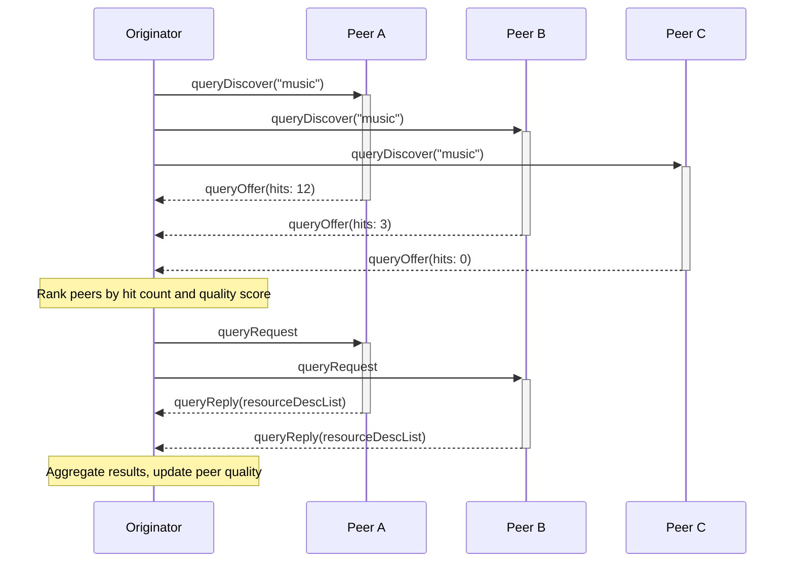

### Adaptive Peer Quality

Peer quality scores adjust automatically based on interaction history. This feedback loop ensures the network self-optimizes over time:

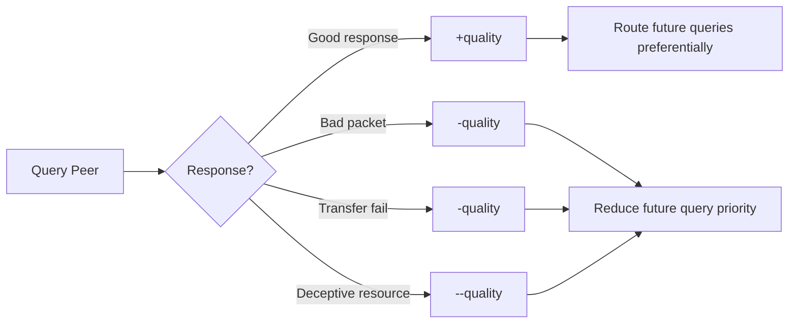

Quality events processed by the rating engine:

| Event | Effect | Trigger |
|-------|--------|---------|
| `queryResponseEvent` | Increase quality | Peer responded with matching resources |
| `clientResourceEvaluation` | Variable | User/system rates a resource (Low / Average / High) |
| `naResourceEvent` | Decrease quality | Advertised resource not available |
| `deceptiveResourceEvent` | Strong decrease | Resource content misrepresented |
| `transferFailureEvent` | Decrease quality | Reliable transfer failed |
| `badPacketEvent` | Decrease quality | Unknown or malformed packet received |

---

## Use Cases

### Narrative: Collaborative Research Team

A distributed research group shares datasets and papers across university networks. Each lab runs an Alpine node that indexes local files. When a researcher queries "climate model 2025", the query fans out to all connected nodes. Peers with matching datasets respond with resource descriptions, ranked by historical reliability. The researcher browses results through the REST API or mounts the FUSE filesystem to see results as directories and files — opening a file triggers retrieval from the owning peer while silently feeding quality metrics back into the network.

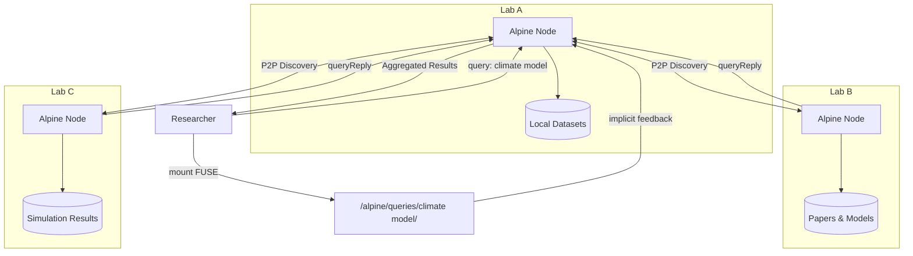

### Narrative: IoT Sensor Network

A fleet of edge devices runs Alpine nodes to share sensor readings and firmware updates. Each device advertises its resources — temperature logs, firmware binaries, calibration data — through the Alpine protocol. A monitoring dashboard queries the network through the REST API to aggregate readings. Peer groups organize devices by location or function, and quality tracking ensures the dashboard preferentially queries responsive, well-connected nodes.

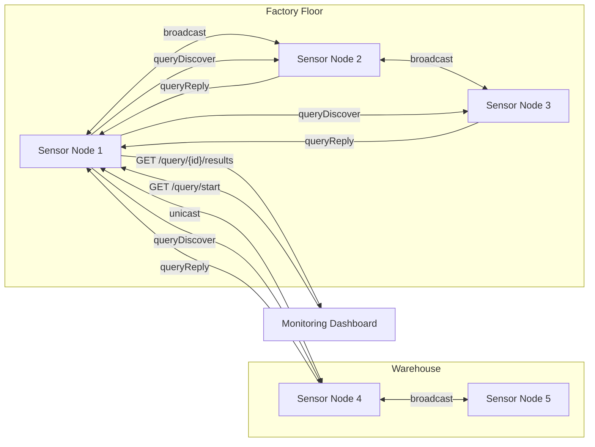

### Narrative: Media Streaming Cluster

A home media network runs Alpine on each device — NAS, media player, laptop. The DLNA integration allows media renderers to discover and play content from any node. The FUSE virtual filesystem provides a unified view: browsing `/alpine/queries/movies/` triggers a live network query and presents results as files that stream on open. Repeated access to high-quality sources automatically increases their peer ranking, while unreachable or slow peers are deprioritized.

---

## Architecture

### Layer Diagram

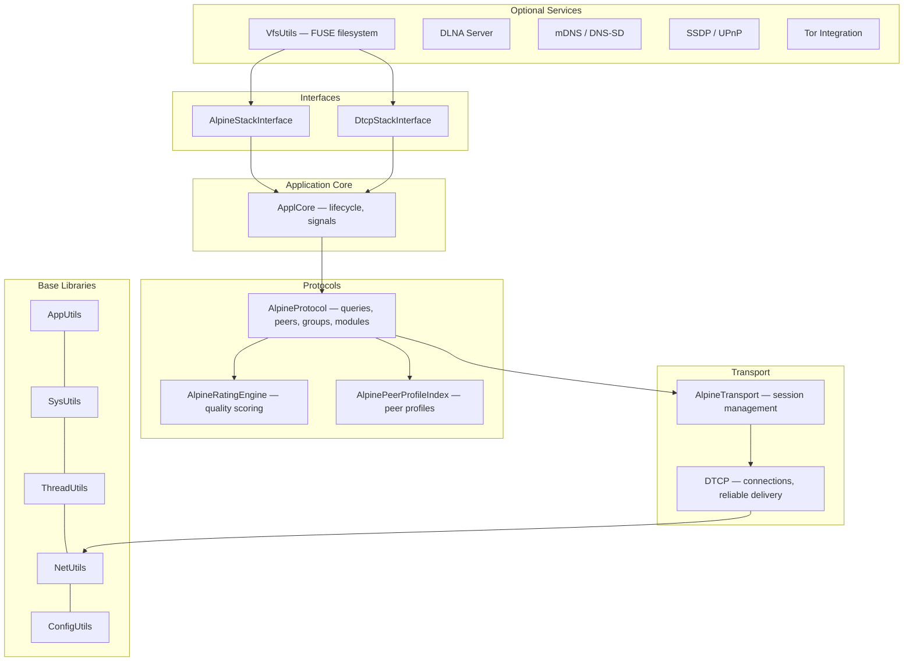

### Directory Structure

```
alpine/
├── base/                       Core libraries
│   ├── AppUtils/                 Hashing (OptHash), callbacks, string utils
│   ├── SysUtils/                 File I/O, process management, DynamicLoader
│   ├── ThreadUtils/              AutoThread, Mutex, ReadWriteSem
│   ├── NetUtils/                 TCP, UDP, multicast, WiFi discovery
│   ├── ConfigUtils/              Configuration management
│   └── VfsUtils/                 FUSE virtual filesystem (optional)
├── protocols/
│   └── Alpine/                 Alpine P2P protocol implementation
├── transport/
│   ├── TransBase/                Transport interfaces
│   ├── Dtcp/                     Direct TCP Protocol
│   └── Alpine/                   Alpine transport (DTCP + Alpine protocol)
├── applcore/                   Application core framework
├── interfaces/
│   ├── AlpineStackInterface/   Primary C++ API
│   └── DtcpStackInterface/     Transport-level API
├── AlpineServer/               Standalone server daemon
├── AlpineCmdIf/                Command-line client
├── AlpineRestBridge/           REST API bridge with DLNA, mDNS, SSDP
├── docker/                     Docker deployment configurations
└── test/                       Test programs
```

### Key Binaries

| Binary | Purpose |
|--------|---------|
| `AlpineServer` | Standalone server daemon with JSON-RPC interface |
| `AlpineCmdIf` | Interactive command-line client |
| `AlpineRestBridge` | REST API server with DLNA, mDNS, SSDP, Tor, FUSE integration |

### Design Patterns

**Static Facade Pattern** — Nearly all major classes are pure static (no instantiation). All methods and data are static, with thread safety via static `ReadWriteSem` or `Mutex` members. This applies to `AlpineStackInterface`, `DtcpStackInterface`, `ApplCore`, `Configuration`, `Log`, `AlpineFuse`, `QueryCache`, `AccessTracker`, and others.

**AutoThread Pattern** — Background threads extend `AutoThread` and override `threadMain()`. Lifecycle is managed via `create()`, `destroy()`, `resume()`, `isActive()`.

**Error Handling** — Modern API methods return `Result<T>` (`std::expected<T, AlpineError>`) for value-returning operations or `Status` (`std::expected<void, AlpineError>`) for void operations. Legacy methods return `bool`.

```cpp
enum class AlpineError {
    NotFound, InvalidArgument, NotInitialized, Timeout,
    ConnectionFailed, PermissionDenied, AlreadyExists,
    NotSupported, InternalError
};

template<typename T>
using Result = std::expected<T, AlpineError>;
using Status = std::expected<void, AlpineError>;
```

---

## Protocol Stack

### Alpine Protocol

The Alpine protocol operates above DTCP and implements the distributed query/response lifecycle:

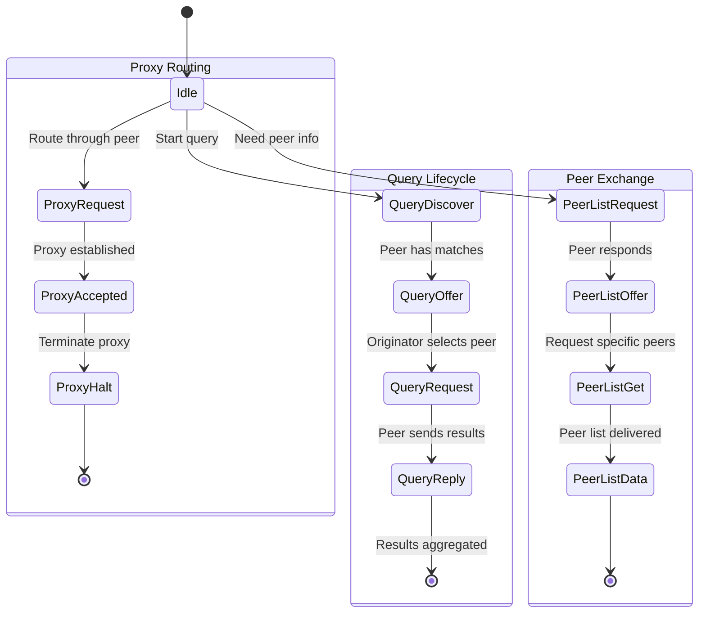

#### Packet Types

| Type | ID | Direction | Description |
|------|----|-----------|-------------|
| `queryDiscover` | 1 | Originator → Peers | Broadcast search term to peer group |
| `queryOffer` | 2 | Peer → Originator | Respond with hit count |
| `queryRequest` | 3 | Originator → Peer | Request full resource descriptions |
| `queryReply` | 4 | Peer → Originator | Deliver resource descriptions |
| `peerListRequest` | 5 | Any → Any | Request known peer list |
| `peerListOffer` | 6 | Any → Any | Offer available peer count |
| `peerListGet` | 7 | Any → Any | Request specific peer entries |
| `peerListData` | 8 | Any → Any | Deliver peer list data |
| `proxyRequest` | 9 | Node → Proxy | Request proxy routing |
| `proxyAccepted` | 10 | Proxy → Node | Proxy route established |
| `proxyHalt` | 11 | Either → Either | Terminate proxy connection |

### DTCP (Direct TCP Protocol)

DTCP provides the transport layer with connection multiplexing, reliable delivery with acknowledgments, and connection suspend/resume:

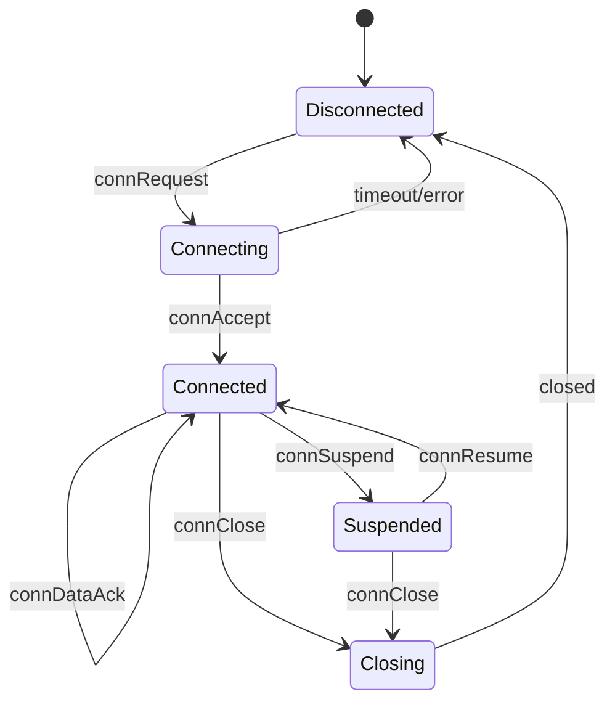

#### DTCP Packet Types

| Type | ID | Description |
|------|----|-------------|
| `connRequest` | 1 | Initiate connection |
| `connOffer` | 2 | Respond to connection request |
| `connAccept` | 3 | Accept connection |
| `connSuspend` | 4 | Suspend active connection |
| `connResume` | 5 | Resume suspended connection |
| `connData` | 6 | Unreliable data transfer |
| `connReliableData` | 7 | Reliable data (requires ACK) |
| `connDataAck` | 8 | Acknowledge reliable data |
| `connClose` | 9 | Close connection |
| `poll` | 10 | Keepalive poll |
| `ack` | 11 | General acknowledgment |
| `error` | 12 | Error notification |
| `natDiscover` | 13 | NAT traversal discovery |
| `natSource` | 14 | NAT source identification |
| `txnData` | 15 | Transaction-multiplexed data |

Maximum packet size: 5,120 bytes.

---

## REST API Reference

The REST bridge runs a multi-threaded HTTP server (ASIO-based) with structured routing and optional API key authentication.

### Query Endpoints

| Method | Path | Description |
|--------|------|-------------|
| `POST` | `/query` | Start a distributed query |
| `GET` | `/query/:id` | Get query status |
| `GET` | `/query/:id/results` | Get aggregated results |
| `GET` | `/query/:id/stream` | Stream results (long-poll) |
| `DELETE` | `/query/:id` | Cancel an active query |

#### Start Query

```
POST /query
Content-Type: application/json

{
  "queryString": "music",
  "groupName": "",
  "autoHaltLimit": 100,
  "autoDownload": false,
  "peerDescMax": 50
}
```

#### Query Status Response

```json
{
  "queryId": 42,
  "totalPeers": 15,
  "peersQueried": 12,
  "numPeerResponses": 8,
  "totalHits": 156
}
```

#### Query Results Response

```json
{
  "queryId": 42,
  "results": {
    "1001": {
      "peerId": 1001,
      "resources": [
        {
          "resourceId": 5001,
          "size": 4194304,
          "description": "Song.mp3",
          "locators": ["http://172.28.1.2:9000/content/5001"],
          "optionId": 0,
          "optionData": ""
        }
      ]
    }
  }
}
```

### Peer Endpoints

| Method | Path | Description |
|--------|------|-------------|
| `GET` | `/peers` | List all discovered peers |
| `GET` | `/peers/:id` | Get specific peer details |

#### Peer Details Response

```json
{
  "peerId": 1001,
  "ipAddress": "172.28.1.2",
  "port": 9000,
  "relativeQuality": 42,
  "totalQueries": 350,
  "totalResponses": 290,
  "avgBandwidth": 1048576,
  "peakBandwidth": 5242880,
  "active": true
}
```

### Status Endpoint

| Method | Path | Description |
|--------|------|-------------|
| `GET` | `/status` | Server and system status |

### Metrics Endpoint

| Method | Path | Description |
|--------|------|-------------|
| `GET` | `/metrics` | Prometheus-format metrics |

### VFS Statistics Endpoints (requires `ALPINE_ENABLE_FUSE`)

| Method | Path | Description |
|--------|------|-------------|
| `GET` | `/vfs/stats` | Global access statistics |
| `GET` | `/vfs/stats/popular` | Most accessed resources |
| `GET` | `/vfs/stats/recent` | Most recently accessed resources |
| `GET` | `/vfs/stats/peer/:id` | Per-peer access statistics |
| `GET` | `/vfs/status` | FUSE mount status |

---

## C++ API Reference

### AlpineStackInterface

The primary programmatic interface. All methods are static.

#### Key Types

```cpp
struct t_QueryOptions {
    string  groupName;         // Target peer group (empty = default)
    ulong   autoHaltLimit;     // Stop after N results
    bool    autoDownload;      // Auto-download content
    ulong   peerDescMax;       // Max resource descriptions per peer
    ulong   optionId;          // Extension option identifier
    string  optionData;        // Extension option payload
};

struct t_ResourceDesc {
    ulong           resourceId;
    ulong           size;
    vector<string>  locators;    // Content retrieval URLs
    string          description;
    ulong           optionId;
    string          optionData;
};

struct t_QueryStatus {
    ulong  totalPeers;         // Known peers in group
    ulong  peersQueried;       // Peers contacted
    ulong  numPeerResponses;   // Peers that responded
    ulong  totalHits;          // Total matching resources
};

struct t_PeerProfile {
    ulong  peerId;
    short  relativeQuality;    // -100 to +100
    ulong  totalQueries;
    ulong  totalResponses;
};

struct t_GroupInfo {
    ulong   groupId;
    string  groupName;
    string  description;
    ulong   numPeers;
    ulong   totalQueries;
    ulong   totalResponses;
};
```

#### Modern API (std::expected)

```cpp
// Queries
Result<ulong>                startQuery2(options, queryString);
Result<t_QueryStatus>        getQueryStatus2(queryId);
Result<t_PeerResourcesIndex> getQueryResults2(queryId);
Status                       pauseQuery2(queryId);
Status                       resumeQuery2(queryId);
Status                       cancelQuery2(queryId);

// Async queries
Result<ulong>  startQueryAsync(options, queryString, callback);

// Groups
Result<ulong>       createGroup2(name, description);
Status              deleteGroup2(groupId);
Result<t_IdList>    listGroups2();
Result<t_GroupInfo> getGroupInfo2(groupId);
Result<t_GroupInfo> getDefaultGroupInfo2();
Result<t_IdList>    getGroupPeerList2(groupId);
Result<t_PeerProfile> getGroupPeerProfile2(groupId, peerId);
Result<t_PeerProfile> getDefaultPeerProfile2(peerId);
Status              addPeerToGroup2(groupId, peerId);
Status              removePeerFromGroup2(groupId, peerId);

// Modules
Result<ulong>        registerModule2(libraryPath, bootstrapSymbol);
Status               unregisterModule2(moduleId);
Result<t_ModuleInfo> getModuleInfo2(moduleId);
Status               loadModule2(moduleId);
Status               unloadModule2(moduleId);
Result<t_IdList>     listActiveModules2();
Result<t_IdList>     listAllModules2();
```

### DtcpStackInterface

Transport-level API for direct peer management. All methods are static, returning `bool`.

```cpp
// Peer management
bool  addDtcpPeer(ipAddress, port);
bool  getDtcpPeerId(ipAddress, port, peerId);
bool  getDtcpPeerStatus(peerId, status);
bool  getAllDtcpPeerIds(peerIdList);
bool  peerExists(ipAddress, port);
bool  peerExists(peerId);
bool  peerIsActive(peerId);
bool  activateDtcpPeer(peerId);
bool  deactivateDtcpPeer(peerId);
bool  pingDtcpPeer(peerId);

// Host/subnet exclusion
bool  excludeHost(ipAddress);
bool  excludeSubnet(subnetIpAddress, subnetMask);
bool  allowHost(ipAddress);
bool  allowSubnet(subnetIpAddress);
bool  hostIsExcluded(ipAddress);
bool  subnetIsExcluded(subnetIpAddress);
bool  peerIsExcluded(peerId);
bool  listExcludedHosts(ipAddressList);
bool  listExcludedSubnets(subnetAddressList);
```

### DtcpPeerStatus

```cpp
struct t_DtcpPeerStatus {
    string  ipAddress;
    ushort  port;
    ulong   lastRecvTime;
    ulong   lastSendTime;
    ulong   avgBandwidth;
    ulong   peakBandwidth;
};
```

---

## FUSE Virtual Filesystem

When built with `ALPINE_ENABLE_FUSE=ON`, Alpine mounts a read-only virtual filesystem that presents live P2P query results, peer information, and access statistics as a directory tree.

### Filesystem Layout

```
/alpine/                                (mount point)
├── queries/                            Search-term directories
│   └── {search-term}/                  Auto-created on first readdir
│       ├── .query_status               Query progress (text)
│       └── {resource-description}      Resource files
├── by-peer/
│   └── {peerId}/
│       ├── .peer_info                  Peer metadata (text)
│       └── {resource files}
├── by-group/
│   └── {groupName}/
│       ├── .group_info                 Group metadata (text)
│       └── peers/
│           └── {peerId}/...
├── by-quality/
│   ├── high/                           Peers with quality > 50
│   ├── medium/                         Quality 0 to 50
│   └── low/                            Quality < 0
├── recent/                             Most recently accessed resources
├── popular/                            Most accessed resources
└── .stats                              Global access statistics
```

### Implicit Feedback Loop

File access events through the FUSE filesystem feed into the adaptive peer quality system:

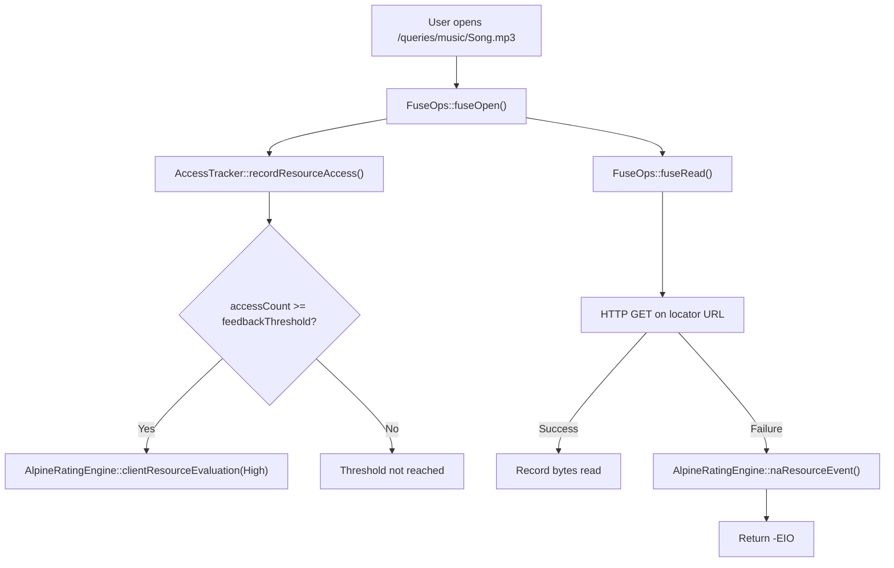

### Platform Support

| Platform | FUSE Version | Library |
|----------|-------------|---------|
| macOS | FUSE 2 (`FUSE_USE_VERSION=26`) | macFUSE |
| Linux | FUSE 3 (`FUSE_USE_VERSION=35`) | libfuse3 |

---

## Module Plugin System

Alpine supports runtime-loadable plugins through `AlpineModuleInterface`:

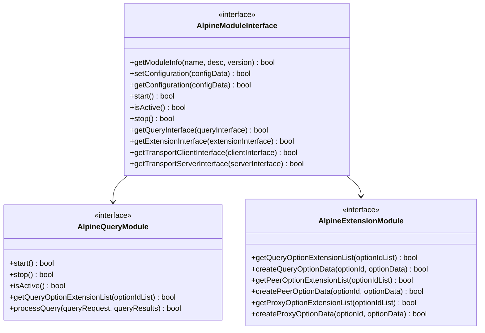

Modules are registered by library path and bootstrap symbol, then loaded dynamically at runtime:

```cpp
auto moduleId = AlpineStackInterface::registerModule2("libMyModule.so", "bootstrap");
AlpineStackInterface::loadModule2(*moduleId);
```

---

## Service Discovery

Beyond its own broadcast protocol, Alpine integrates with standard service discovery mechanisms:

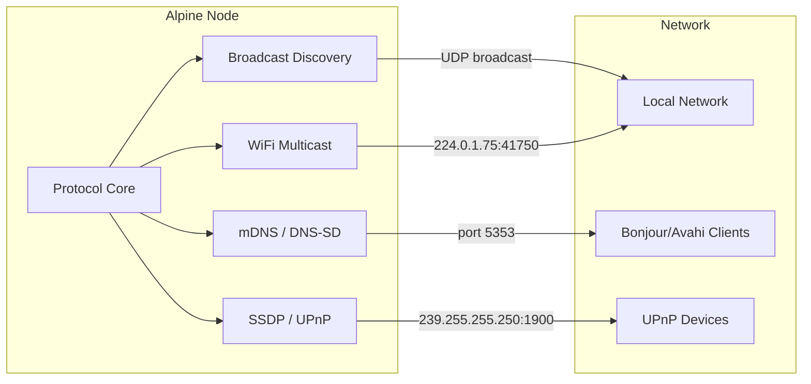

| Protocol | Port | Description |
|----------|------|-------------|
| **mDNS / DNS-SD** | 5353 | Multicast DNS service announcement |
| **SSDP / UPnP** | 1900 | UPnP device discovery (M-SEARCH / NOTIFY) |
| **WiFi Multicast** | 41750 | WiFi-layer peer detection (group 224.0.1.75) |
| **Broadcast** | 8090 | Alpine-native broadcast discovery |
| **Beacon** | 8089 | Periodic beacon announcements |

---

## Configuration

Configuration values are resolved in order of precedence: **config file** > **command-line argument** > **environment variable** > **default**.

### Core Configuration

| Name | CLI Flag | Environment Variable | Default | Description |
|------|----------|---------------------|---------|-------------|
| Port | `port` | `PORT` | 9000 | Main protocol port |
| REST Port | `restPort` | `REST_PORT` | 8080 | HTTP API port |
| REST Bind Address | `restBindAddress` | `REST_BIND_ADDRESS` | 0 | REST bind address |
| Beacon Port | `beaconPort` | `BEACON_PORT` | 8089 | Beacon discovery port |
| Beacon Enabled | `beaconEnabled` | `BEACON_ENABLED` | true | Enable beacon discovery |
| Broadcast Port | `broadcastPort` | `BROADCAST_PORT` | 8090 | Broadcast discovery port |
| Broadcast Enabled | `broadcastEnabled` | `BROADCAST_ENABLED` | true | Enable broadcast discovery |
| WiFi Multicast Group | `wifiMulticastGroup` | `WIFI_MULTICAST_GROUP` | 224.0.1.75 | Multicast group address |
| WiFi Multicast Port | `wifiMulticastPort` | `WIFI_MULTICAST_PORT` | 41750 | Multicast port |
| Log Level | `logLevel` | `LOG_LEVEL` | Info | Logging level (Silent/Error/Info/Debug) |
| Node Name | `nodeName` | `NODE_NAME` | — | Human-readable node identifier |
| Tor Enabled | `torEnabled` | `TOR_ENABLED` | false | Enable Tor integration |
| DLNA Enabled | `dlnaEnabled` | `DLNA_ENABLED` | false | Enable DLNA media server |

### FUSE Configuration (requires `ALPINE_ENABLE_FUSE`)

| Name | CLI Flag | Environment Variable | Default | Description |
|------|----------|---------------------|---------|-------------|
| FUSE Enabled | `fuseEnabled` | `FUSE_ENABLED` | false | Enable FUSE virtual filesystem |
| FUSE Mount Point | `fuseMountPoint` | `FUSE_MOUNT_POINT` | /tmp/alpine | Filesystem mount path |
| FUSE Cache TTL | `fuseCacheTtl` | `FUSE_CACHE_TTL` | 60 | Query cache TTL (seconds) |
| FUSE Feedback Threshold | `fuseFeedbackThreshold` | `FUSE_FEEDBACK_THRESHOLD` | 5 | Accesses before positive feedback |

---

## Building

Requires CMake 3.28+ and a C++23-capable compiler.

```sh
# Standard release build
cmake -B build -DCMAKE_BUILD_TYPE=Release
cmake --build build

# Debug build
cmake -B build -DCMAKE_BUILD_TYPE=Debug
cmake --build build

# Profile build (with -pg for gprof)
cmake -B build -DCMAKE_BUILD_TYPE=Profile
cmake --build build

# Build with sanitizers
cmake -B build -DALPINE_SANITIZER=address,undefined
cmake --build build
```

### Build Options

| Flag | Default | Description |
|------|---------|-------------|
| `ALPINE_ENABLE_CORBA` | OFF | CORBA remote management (requires ACE/TAO) |
| `ALPINE_ENABLE_TLS` | OFF | TLS/DTLS encryption |
| `ALPINE_ENABLE_FUSE` | OFF | FUSE virtual filesystem (requires libfuse/macFUSE) |
| `ALPINE_ENABLE_UPNP` | OFF | UPnP IGD port mapping |
| `ALPINE_ENABLE_PERSISTENCE` | OFF | SQLite persistence layer |
| `ALPINE_ENABLE_TRACING` | OFF | OpenTelemetry distributed tracing |
| `ALPINE_BUILD_TESTS` | ON | Build test programs |
| `ALPINE_BUILD_BENCHMARKS` | OFF | Build benchmark programs |
| `ALPINE_BUILD_FUZZERS` | OFF | Build libFuzzer targets (requires Clang) |
| `ALPINE_USE_SYSTEM_DEPS` | OFF | Use system packages instead of FetchContent |
| `ALPINE_SANITIZER` | — | Sanitizer mode (address, undefined, thread, memory) |

### Dependencies

Fetched automatically via CMake FetchContent unless `ALPINE_USE_SYSTEM_DEPS=ON`:

| Dependency | Version | Purpose |
|------------|---------|---------|
| [nlohmann/json](https://github.com/nlohmann/json) | 3.11.3 | JSON serialization |
| [ASIO](https://think-async.com/Asio/) | 1.30.2 | Async networking (standalone, no Boost) |
| [spdlog](https://github.com/gabime/spdlog) | 1.14.1 | Logging backend |
| [Catch2](https://github.com/catchorg/Catch2) | 3.5.2 | Testing framework (if tests enabled) |
| [jwt-cpp](https://github.com/Thalhammer/jwt-cpp) | 0.7.0 | JWT authentication (if TLS enabled) |
| [miniupnpc](https://miniupnp.tuxfamily.org/) | 2.2.7 | UPnP port mapping (if UPnP enabled) |
| [SQLite](https://sqlite.org) | 3.45.0 | Persistence (if persistence enabled) |
| [OpenTelemetry](https://opentelemetry.io/) | 1.14.2 | Distributed tracing (if tracing enabled) |
| [Google Benchmark](https://github.com/google/benchmark) | 1.8.3 | Benchmarks (if benchmarks enabled) |

---

## Deployment

### Standalone Server

```sh
./build/bin/AlpineServer
```

The server daemon handles signal-based lifecycle management (graceful shutdown on SIGTERM) and supports configuration hot-reload.

### REST Bridge

```sh
./build/bin/AlpineRestBridge
```

Full-featured HTTP API server with DLNA, mDNS, SSDP, Tor, and FUSE integration.

### Docker

```sh
# 3-node cluster
docker-compose -f docker/docker-compose.yml up

# 5-node cluster with benchmark nodes
docker-compose -f docker/docker-compose.yml --profile bench up
```

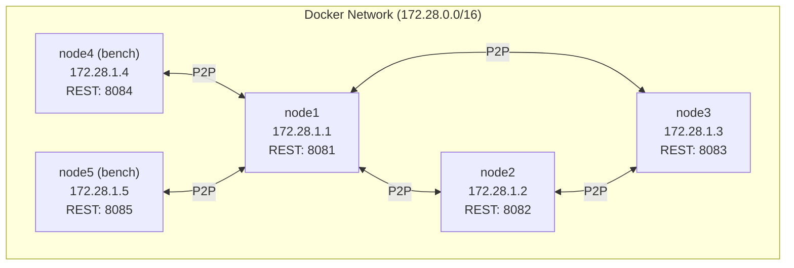

| Node | IP | REST Port | Profile |
|------|----|-----------|---------|
| node1 | 172.28.1.1 | 8081 | default |
| node2 | 172.28.1.2 | 8082 | default |
| node3 | 172.28.1.3 | 8083 | default |
| node4 | 172.28.1.4 | 8084 | bench |
| node5 | 172.28.1.5 | 8085 | bench |

Health checks: `curl -sf http://localhost:{port}/status` every 5 seconds.

---

## Security

- **Duplicate packet detection** with configurable thresholds
- **Packet size limits** for queries, resource descriptions, and peer lists
- **Peer banning** for misbehaving nodes
- **Bad packet tracking** with per-peer counters and quality impact
- **Reliable transfer failure monitoring** with automatic quality adjustment
- **Host/subnet exclusion** lists for network-level blocking
- **API key authentication** middleware for REST endpoints
- **NAT traversal** discovery for secure peer-to-peer connections

---

## License

MIT

## Copyright

Copyright (c) 2026 sonoransun
