# Alpine

A decentralized peer-to-peer resource discovery and distributed querying platform built in modern C++23.

Alpine enables autonomous nodes to discover each other, share resource metadata, and retrieve content across a network without relying on any central directory or coordinator. Peers locate one another through broadcast-based discovery, exchange queries in parallel, and aggregate results from across the network — all driven by adaptive quality metrics that learn which peers are most reliable over time.

---

## Table of Contents

- [How It Works](#how-it-works)
- [Use Cases](#use-cases)
- [Quick Start](#quick-start)
- [Architecture](#architecture)
- [Protocol Stack](#protocol-stack)
- [CLI Reference](#cli-reference)
- [REST API Reference](#rest-api-reference)
- [JSON-RPC Interface](#json-rpc-interface)
- [C++ API Reference](#c-api-reference)
- [FUSE Virtual Filesystem](#fuse-virtual-filesystem)
- [Module Plugin System](#module-plugin-system)
- [Service Discovery](#service-discovery)
- [Configuration](#configuration)
- [Building](#building)
- [Testing](#testing)
- [Platform Support](#platform-support)
- [Deployment](#deployment)
- [Feature Guides](#feature-guides)
- [Monitoring & Metrics](#monitoring--metrics)
- [Security](#security)
- [License](#license)

---

## How It Works

### Decentralized Resource Discovery

Alpine's discovery model operates without a central index. Every node is both a producer and a consumer of resources:

- **Broadcast discovery** — Nodes announce their presence and discover peers through UDP multicast and broadcast mechanisms. No registration server is required.
- **Distributed querying** — A query originator broadcasts a `queryDiscover` packet to a group of peers. Peers that hold matching resources respond with a `queryOffer` indicating their hit count. The originator then sends `queryRequest` messages to the most promising peers and collects `queryReply` packets containing full resource descriptions.
- **Peer quality tracking** — Each node maintains per-peer quality scores based on response rates and reliability. Future queries are routed preferentially toward peers that have historically provided fast, accurate results.
- **Peer groups** — Peers can be organized into logical groups with independent quality profiles, enabling targeted queries to subsets of the network.

### Query Lifecycle

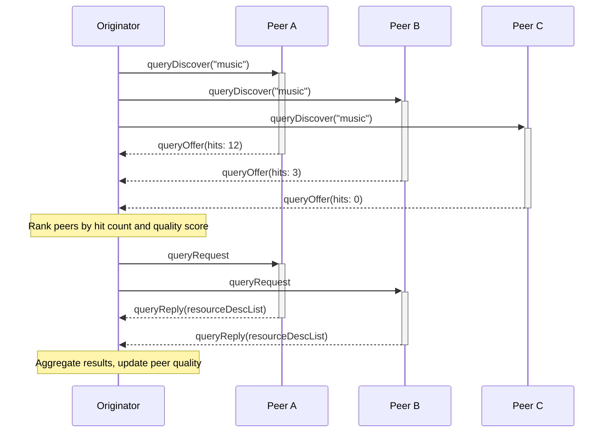

### Adaptive Peer Quality

Peer quality scores adjust automatically based on interaction history. This feedback loop ensures the network self-optimizes over time:

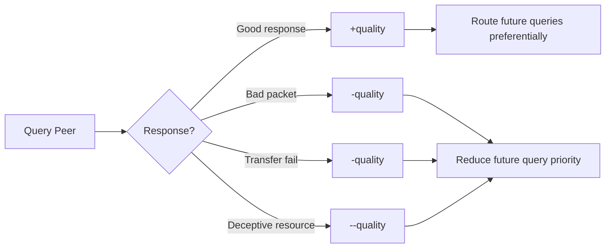

Quality events processed by the rating engine:

| Event | Effect | Trigger |
|-------|--------|---------|
| `queryResponseEvent` | Increase quality | Peer responded with matching resources |
| `clientResourceEvaluation` | Variable | User/system rates a resource (Low / Average / High) |
| `naResourceEvent` | Decrease quality | Advertised resource not available |
| `deceptiveResourceEvent` | Strong decrease | Resource content misrepresented |
| `transferFailureEvent` | Decrease quality | Reliable transfer failed |
| `badPacketEvent` | Decrease quality | Unknown or malformed packet received |

---

## Use Cases

### Narrative: Collaborative Research Team

A distributed research group shares datasets and papers across university networks. Each lab runs an Alpine node that indexes local files. When a researcher queries "climate model 2025", the query fans out to all connected nodes. Peers with matching datasets respond with resource descriptions, ranked by historical reliability. The researcher browses results through the REST API or mounts the FUSE filesystem to see results as directories and files — opening a file triggers retrieval from the owning peer while silently feeding quality metrics back into the network.

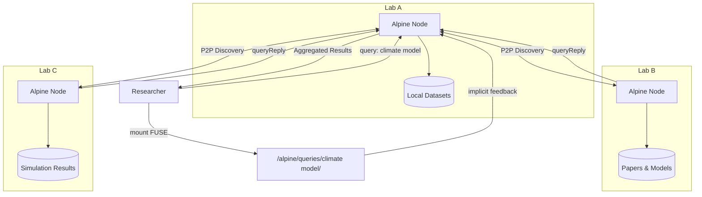

### Narrative: IoT Sensor Network

A fleet of edge devices runs Alpine nodes to share sensor readings and firmware updates. Each device advertises its resources — temperature logs, firmware binaries, calibration data — through the Alpine protocol. A monitoring dashboard queries the network through the REST API to aggregate readings. Peer groups organize devices by location or function, and quality tracking ensures the dashboard preferentially queries responsive, well-connected nodes.

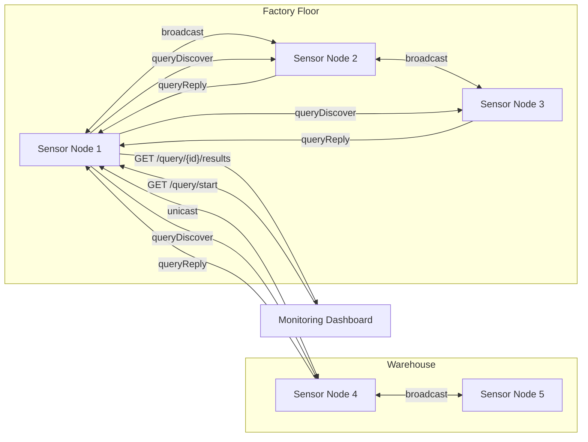

### Narrative: Media Streaming Cluster

A home media network runs Alpine on each device — NAS, media player, laptop. The DLNA integration allows media renderers to discover and play content from any node. The FUSE virtual filesystem provides a unified view: browsing `/alpine/queries/movies/` triggers a live network query and presents results as files that stream on open. Repeated access to high-quality sources automatically increases their peer ranking, while unreachable or slow peers are deprioritized.

---

## Quick Start

### Prerequisites

- **CMake** 3.28+
- **C++23 compiler**: GCC 14+, Clang 17+, or MSVC 2022
- **POSIX environment** (Linux, macOS, FreeBSD) or Windows with Winsock

### Build and Run

```sh
# Build
cmake -B build -DCMAKE_BUILD_TYPE=Release
cmake --build build

# Start the server
./build/bin/AlpineServer

# In another terminal, verify it's running
curl http://localhost:8080/status
```

### Your First Query

```sh
# Start a query
curl -X POST http://localhost:8080/query \
  -H "Content-Type: application/json" \
  -d '{"queryString": "music", "autoHaltLimit": 50}'

# Check results (replace 1 with your query ID)
curl http://localhost:8080/query/1/results
```

### Docker Quick Start

```sh
# Start a 3-node cluster
docker-compose -f docker/docker-compose.yml up

# Query node1
curl -X POST http://localhost:8081/query \
  -H "Content-Type: application/json" \
  -d '{"queryString": "test"}'

# Check cluster status
curl http://localhost:8081/cluster/status
```

### CLI Quick Start

```sh
# Query via CLI
./build/bin/AlpineCmdIf --serverAddress 127.0.0.1 --serverPort 9000 \
  --command beginQuery --queryString "music"

# Get server status
./build/bin/AlpineCmdIf --serverAddress 127.0.0.1 --serverPort 9000 \
  --command getStatus --json
```

---

## Architecture

### Layer Diagram

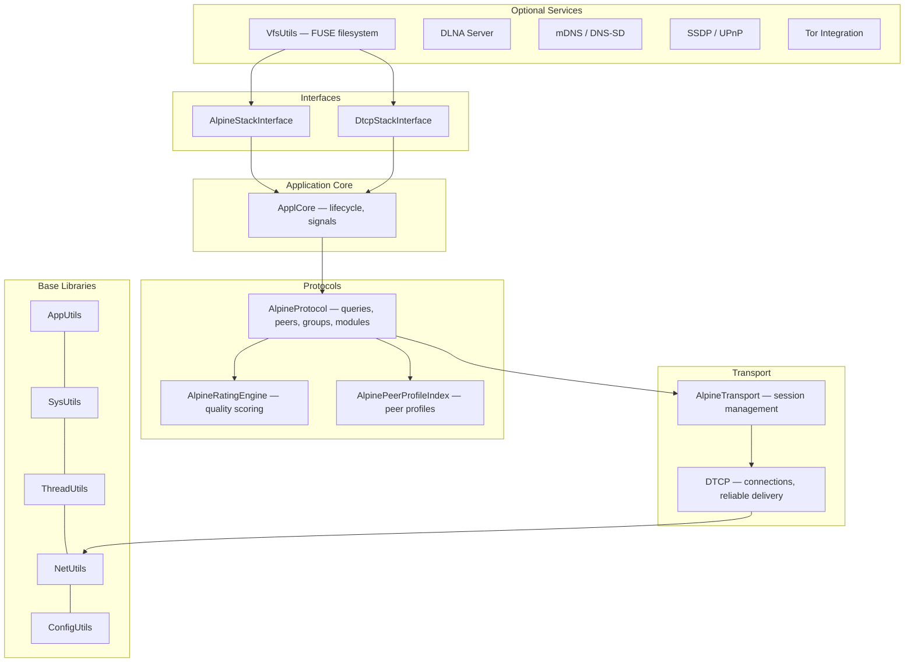

### Directory Structure

```
alpine/
├── base/                       Core libraries
│   ├── AppUtils/                 Hashing (OptHash), callbacks, string utils
│   ├── SysUtils/                 File I/O, process management, DynamicLoader
│   ├── ThreadUtils/              AutoThread, Mutex, ReadWriteSem
│   ├── NetUtils/                 TCP, UDP, multicast, WiFi discovery
│   ├── ConfigUtils/              Configuration management
│   └── VfsUtils/                 FUSE virtual filesystem (optional)
├── protocols/
│   └── Alpine/                 Alpine P2P protocol implementation
├── transport/
│   ├── TransBase/                Transport interfaces
│   ├── Dtcp/                     Direct TCP Protocol
│   └── Alpine/                   Alpine transport (DTCP + Alpine protocol)
├── applcore/                   Application core framework
├── interfaces/
│   ├── AlpineStackInterface/   Primary C++ API
│   └── DtcpStackInterface/     Transport-level API
├── AlpineServer/               Standalone server daemon
├── AlpineCmdIf/                Command-line client
├── AlpineRestBridge/           REST API bridge with DLNA, mDNS, SSDP
├── docker/                     Docker deployment configurations
└── test/                       Test programs
```

### Key Binaries

| Binary | Purpose |
|--------|---------|
| `AlpineServer` | Standalone server daemon with JSON-RPC interface |
| `AlpineCmdIf` | Interactive command-line client |
| `AlpineRestBridge` | REST API server with DLNA, mDNS, SSDP, Tor, FUSE integration |

### Design Patterns

**Static Facade Pattern** — Nearly all major classes are pure static (no instantiation). All methods and data are static, with thread safety via static `ReadWriteSem` or `Mutex` members. This applies to `AlpineStackInterface`, `DtcpStackInterface`, `ApplCore`, `Configuration`, `Log`, `AlpineFuse`, `QueryCache`, `AccessTracker`, and others.

**AutoThread Pattern** — Background threads extend `AutoThread` and override `threadMain()`. Lifecycle is managed via `create()`, `destroy()`, `resume()`, `isActive()`.

**Error Handling** — Modern API methods return `Result<T>` (`std::expected<T, AlpineError>`) for value-returning operations or `Status` (`std::expected<void, AlpineError>`) for void operations. Legacy methods return `bool`.

```cpp
enum class AlpineError {
    NotFound, InvalidArgument, NotInitialized, Timeout,
    ConnectionFailed, PermissionDenied, AlreadyExists,
    NotSupported, InternalError
};

template<typename T>
using Result = std::expected<T, AlpineError>;
using Status = std::expected<void, AlpineError>;
```

---

## Protocol Stack

### Alpine Protocol

The Alpine protocol operates above DTCP and implements the distributed query/response lifecycle:

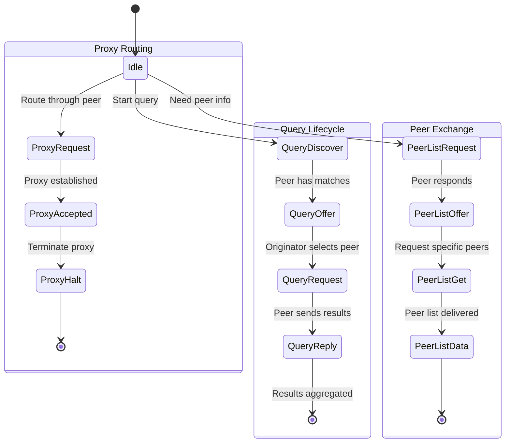

#### Packet Types

| Type | ID | Direction | Description |
|------|----|-----------|-------------|
| `queryDiscover` | 1 | Originator → Peers | Broadcast search term to peer group |
| `queryOffer` | 2 | Peer → Originator | Respond with hit count |
| `queryRequest` | 3 | Originator → Peer | Request full resource descriptions |
| `queryReply` | 4 | Peer → Originator | Deliver resource descriptions |
| `peerListRequest` | 5 | Any → Any | Request known peer list |
| `peerListOffer` | 6 | Any → Any | Offer available peer count |
| `peerListGet` | 7 | Any → Any | Request specific peer entries |
| `peerListData` | 8 | Any → Any | Deliver peer list data |
| `proxyRequest` | 9 | Node → Proxy | Request proxy routing |
| `proxyAccepted` | 10 | Proxy → Node | Proxy route established |
| `proxyHalt` | 11 | Either → Either | Terminate proxy connection |

### DTCP (Direct TCP Protocol)

DTCP provides the transport layer with connection multiplexing, reliable delivery with acknowledgments, and connection suspend/resume:

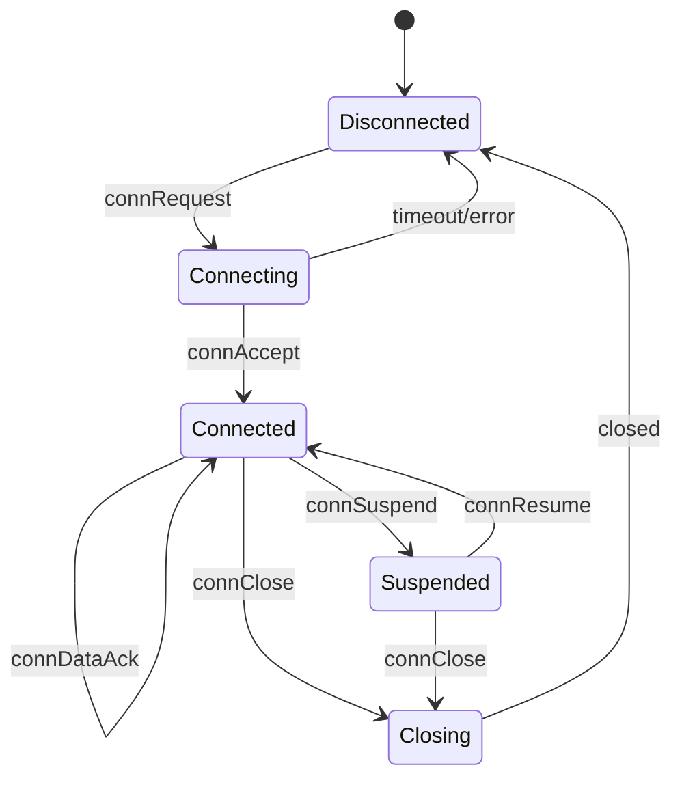

#### DTCP Packet Types

| Type | ID | Description |
|------|----|-------------|
| `connRequest` | 1 | Initiate connection |
| `connOffer` | 2 | Respond to connection request |
| `connAccept` | 3 | Accept connection |
| `connSuspend` | 4 | Suspend active connection |
| `connResume` | 5 | Resume suspended connection |
| `connData` | 6 | Unreliable data transfer |
| `connReliableData` | 7 | Reliable data (requires ACK) |
| `connDataAck` | 8 | Acknowledge reliable data |
| `connClose` | 9 | Close connection |
| `poll` | 10 | Keepalive poll |
| `ack` | 11 | General acknowledgment |
| `error` | 12 | Error notification |
| `natDiscover` | 13 | NAT traversal discovery |
| `natSource` | 14 | NAT source identification |
| `txnData` | 15 | Transaction-multiplexed data |

Maximum packet size: 5,120 bytes.

---

## CLI Reference

`AlpineCmdIf` is a command-line client that communicates with `AlpineServer` via JSON-RPC.

### Usage

```
AlpineCmdIf --serverAddress <addr> --serverPort <port> --command <cmd> [options]
```

### Global Flags

| Flag | Description |
|------|-------------|
| `-h`, `--help` | Show usage information |
| `-v`, `--version` | Show version |
| `--verbose` | Enable verbose output |
| `--json` | Output results as JSON |
| `--quiet` | Suppress non-essential output |

### Peer Commands

| Command | Description | Key Arguments |
|---------|-------------|---------------|
| `addDtcpPeer` | Add a DTCP peer by IP and port | `--ipAddress <ip> --port <port>` |
| `getDtcpPeerId` | Get the peer ID for a given address | `--ipAddress <ip> --port <port>` |
| `getDtcpPeerStatus` | Get status details for a peer | `--peerId <id>` |
| `activateDtcpPeer` | Activate a peer connection | `--peerId <id>` |
| `deactivateDtcpPeer` | Deactivate a peer connection | `--peerId <id>` |
| `pingDtcpPeer` | Ping a peer to check connectivity | `--peerId <id>` |
| `getExtendedPeerList` | Get extended list of all peers | _(none)_ |

### Network Filter Commands

| Command | Description | Key Arguments |
|---------|-------------|---------------|
| `excludeHost` | Exclude a host by IP address | `--ipAddress <ip>` |
| `excludeSubnet` | Exclude a subnet | `--subnetIpAddress <ip> --subnetMask <mask>` |
| `allowHost` | Allow a previously excluded host | `--ipAddress <ip>` |
| `allowSubnet` | Allow a previously excluded subnet | `--subnetIpAddress <ip>` |
| `listExcludedHosts` | List all excluded hosts | _(none)_ |
| `listExcludedSubnets` | List all excluded subnets | _(none)_ |

### Query Commands

| Command | Description | Key Arguments |
|---------|-------------|---------------|
| `beginQuery` | Start a new resource query | `--queryString <query> [--groupName <group>] [--autoHaltLimit <n>] [--peerDescriptionLimit <n>]` |
| `getQueryStatus` | Get status of a running query | `--queryId <id>` |
| `pauseQuery` | Pause a running query | `--queryId <id>` |
| `resumeQuery` | Resume a paused query | `--queryId <id>` |
| `cancelQuery` | Cancel a query | `--queryId <id>` |
| `getQueryResults` | Get results of a query | `--queryId <id>` |

### Group Commands

| Command | Description | Key Arguments |
|---------|-------------|---------------|
| `getUserGroupList` | List all user groups | _(none)_ |
| `createUserGroup` | Create a new user group | `--groupName <name> [--description <desc>]` |
| `destroyUserGroup` | Delete a user group | `--groupId <id>` |
| `getPeerUserGroupList` | List peers in a group | `--groupId <id>` |
| `addPeerToGroup` | Add a peer to a group | `--groupId <id> --peerId <id>` |
| `removePeerFromGroup` | Remove a peer from a group | `--groupId <id> --peerId <id>` |

### Module Commands

| Command | Description | Key Arguments |
|---------|-------------|---------------|
| `registerModule` | Register a new module | `--moduleLibPath <path> --moduleSymbol <sym>` |
| `unregisterModule` | Unregister a module | `--moduleId <id>` |
| `loadModule` | Load a registered module | `--moduleId <id>` |
| `unloadModule` | Unload an active module | `--moduleId <id>` |
| `listActiveModules` | List currently loaded modules | _(none)_ |
| `listAllModules` | List all registered modules | _(none)_ |
| `getModuleInfo` | Get detailed module information | `--moduleId <id>` |

### Status Commands

| Command | Description | Key Arguments |
|---------|-------------|---------------|
| `getStatus` | Get server status and version | _(none)_ |

### CLI Examples

```sh
# Add a peer and check its status
./build/bin/AlpineCmdIf --serverAddress 127.0.0.1 --serverPort 9000 \
  --command addDtcpPeer --ipAddress 192.168.1.10 --port 9000

# Run a query with JSON output
./build/bin/AlpineCmdIf --serverAddress 127.0.0.1 --serverPort 9000 \
  --command beginQuery --queryString "documents" --json

# Ban a misbehaving host
./build/bin/AlpineCmdIf --serverAddress 127.0.0.1 --serverPort 9000 \
  --command excludeHost --ipAddress 10.0.0.5

# Get per-command help
./build/bin/AlpineCmdIf --command help --queryString beginQuery
```

---

## REST API Reference

The REST bridge runs a multi-threaded HTTP server (ASIO-based) with structured routing and optional API key authentication.

### Common Features

#### Pagination

The `/query/:id/results` and `/peers` endpoints support pagination via query parameters:

| Parameter | Default | Max | Description |
|-----------|---------|-----|-------------|
| `limit` | 100 | 1000 | Number of items to return |
| `offset` | 0 | — | Number of items to skip |

Paginated responses include metadata:

```json
{
  "data": [...],
  "total": 250,
  "limit": 100,
  "offset": 0,
  "hasMore": true
}
```

#### Peer Filtering

`GET /peers` supports filtering via query parameters:

| Parameter | Values | Description |
|-----------|--------|-------------|
| `status` | `active`, `inactive` | Filter by peer connection status |
| `minScore` | float | Minimum peer quality score |

```sh
# Get only active peers with score above 50
curl "http://localhost:8080/peers?status=active&minScore=50"
```

#### Request Correlation

All responses support the `X-Request-ID` header for request tracing. Pass an `X-Request-ID` header in your request and it will be echoed in the response.

#### Error Format

Error responses follow a structured JSON format:

```json
{
  "error": {
    "code": "INVALID_PARAMETER",
    "message": "Missing queryString"
  }
}
```

Error codes:

| Code | HTTP Status | Description |
|------|-------------|-------------|
| `INVALID_PARAMETER` | 400 | Invalid or missing request parameter |
| `NOT_FOUND` | 404 | Resource not found |
| `RATE_LIMITED` | 429 | Too many requests |
| `UNAUTHORIZED` | 401 | Authentication required |
| `INTERNAL_ERROR` | 500 | Server-side failure |
| `SERVICE_UNAVAILABLE` | 503 | Service temporarily unavailable |
| `CONFLICT` | 409 | Conflicting operation |

### Query Endpoints

| Method | Path | Description |
|--------|------|-------------|
| `POST` | `/query` | Start a distributed query |
| `GET` | `/query/:id` | Get query status |
| `GET` | `/query/:id/results` | Get aggregated results (paginated) |
| `GET` | `/query/:id/stream` | Stream results via SSE |
| `DELETE` | `/query/:id` | Cancel an active query |

#### Start Query

```sh
curl -X POST http://localhost:8080/query \
  -H "Content-Type: application/json" \
  -d '{
    "queryString": "music",
    "groupName": "",
    "autoHaltLimit": 100,
    "peerDescMax": 50
  }'
```

Response (202 Accepted):

```json
{
  "queryId": 42
}
```

The `Location` header contains the status URL: `/query/42`.

#### Query Status

```sh
curl http://localhost:8080/query/42
```

```json
{
  "queryId": 42,
  "inProgress": true,
  "totalPeers": 15,
  "peersQueried": 12,
  "numPeerResponses": 8,
  "totalHits": 156
}
```

#### Query Results (Paginated)

```sh
curl "http://localhost:8080/query/42/results?limit=10&offset=0"
```

```json
{
  "queryId": 42,
  "data": [
    {
      "peerId": 1001,
      "resourceId": 5001,
      "size": 4194304,
      "description": "Song.mp3",
      "locators": ["http://172.28.1.2:9000/content/5001"]
    }
  ],
  "total": 156,
  "limit": 10,
  "offset": 0,
  "hasMore": true
}
```

#### Stream Results (SSE)

```sh
curl http://localhost:8080/query/42/stream
```

Returns Server-Sent Events with `Content-Type: text/event-stream`:

```
event: result
data: {"queryId":42,"peerId":1001,"resources":[...]}

event: progress
data: {"queryId":42,"totalPeers":15,"peersQueried":12,"totalHits":156}

event: complete
data: {"queryId":42,"totalPeers":8}
```

#### Cancel Query

```sh
curl -X DELETE http://localhost:8080/query/42
```

### Peer Endpoints

| Method | Path | Description |
|--------|------|-------------|
| `GET` | `/peers` | List all discovered peers (paginated, filterable) |
| `GET` | `/peers/:id` | Get specific peer details |

#### List Peers

```sh
curl "http://localhost:8080/peers?limit=50&status=active"
```

#### Peer Details

```sh
curl http://localhost:8080/peers/1001
```

```json
{
  "peerId": 1001,
  "ipAddress": "172.28.1.2",
  "port": 9000,
  "lastRecvTime": 1709712000,
  "lastSendTime": 1709711990,
  "avgBandwidth": 1048576,
  "peakBandwidth": 5242880
}
```

### Admin Endpoints

| Method | Path | Description |
|--------|------|-------------|
| `POST` | `/admin/peers/:id/ban` | Ban a peer by ID |
| `DELETE` | `/admin/peers/:id/ban` | Unban a peer |
| `GET` | `/admin/peers/banned` | List all banned peers |
| `POST` | `/admin/config/reload` | Hot-reload configuration |
| `GET` | `/admin/logs/level` | Get current log level |
| `PUT` | `/admin/logs/level` | Set log level |

#### Ban a Peer

```sh
curl -X POST http://localhost:8080/admin/peers/1001/ban
```

```json
{
  "banned": true,
  "peerId": 1001,
  "ipAddress": "172.28.1.2"
}
```

#### Unban a Peer

```sh
curl -X DELETE http://localhost:8080/admin/peers/1001/ban
```

#### List Banned Peers

```sh
curl http://localhost:8080/admin/peers/banned
```

```json
{
  "banned": ["172.28.1.2", "10.0.0.5"],
  "total": 2
}
```

#### Reload Configuration

```sh
curl -X POST http://localhost:8080/admin/config/reload
```

#### Set Log Level

```sh
curl -X PUT http://localhost:8080/admin/logs/level \
  -H "Content-Type: application/json" \
  -d '{"level": "Debug"}'
```

Valid levels: `Silent`, `Error`, `Info`, `Debug`.

### Auth Endpoints

Device-based challenge-response authentication (requires `ALPINE_ENABLE_TLS` for signature verification):

| Method | Path | Description |
|--------|------|-------------|
| `POST` | `/auth/enroll-device` | Enroll a device with its public key |
| `GET` | `/auth/challenge` | Get a challenge nonce |
| `POST` | `/auth/verify` | Verify a signed challenge |

#### Authentication Flow

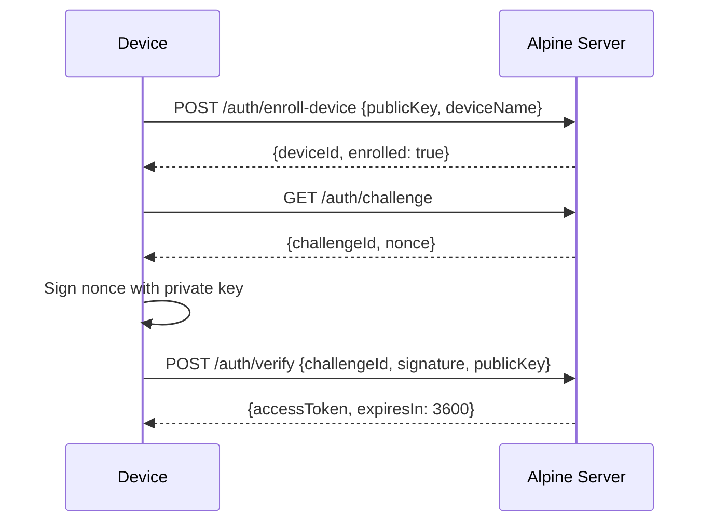

#### Enroll Device

```sh
curl -X POST http://localhost:8080/auth/enroll-device \
  -H "Content-Type: application/json" \
  -d '{"publicKey": "-----BEGIN PUBLIC KEY-----\n...", "deviceName": "laptop", "biometricType": "fingerprint"}'
```

#### Get Challenge

```sh
curl http://localhost:8080/auth/challenge
```

```json
{
  "challengeId": "a1b2c3d4...",
  "nonce": "e5f6a7b8..."
}
```

#### Verify Signature

```sh
curl -X POST http://localhost:8080/auth/verify \
  -H "Content-Type: application/json" \
  -d '{"challengeId": "a1b2c3d4...", "signature": "deadbeef...", "publicKey": "-----BEGIN PUBLIC KEY-----\n..."}'
```

### Cluster Endpoints

| Method | Path | Description |
|--------|------|-------------|
| `GET` | `/cluster/status` | Cluster membership and node status |
| `POST` | `/cluster/query` | Submit a cluster-aware query (with dedup and load balancing) |
| `POST` | `/cluster/heartbeat` | Receive heartbeat from a peer node |
| `GET` | `/cluster/results/:id` | Get federated results across cluster nodes |

#### Cluster Status

```sh
curl http://localhost:8080/cluster/status
```

```json
{
  "nodeId": "node-a1b2c3d4",
  "region": "us",
  "isolated": false,
  "clusterSize": 3,
  "nodes": [
    {
      "nodeId": "node-a1b2c3d4",
      "host": "us-node1",
      "restPort": 8080,
      "activeQueries": 2,
      "connectionCount": 5,
      "region": "us",
      "capabilities": ["query", "transfer", "stream"]
    }
  ]
}
```

#### Cluster Query (with Deduplication)

```sh
curl -X POST http://localhost:8080/cluster/query \
  -H "Content-Type: application/json" \
  -d '{"queryString": "music", "groupName": "", "autoHaltLimit": 100}'
```

The cluster coordinator checks for duplicate queries and load-balances across nodes. If another node is already processing the same query, you receive a 307 redirect. If the local node is overloaded, the request is redirected to a less-loaded node.

#### Federated Results

```sh
curl http://localhost:8080/cluster/results/42
```

Returns local results plus aggregated results from other cluster nodes processing the same query hash.

### Status Endpoint

| Method | Path | Description |
|--------|------|-------------|
| `GET` | `/status` | Server and system status |

### Metrics Endpoint

| Method | Path | Description |
|--------|------|-------------|
| `GET` | `/metrics` | Prometheus-format metrics |

See [Monitoring & Metrics](#monitoring--metrics) for details.

### API Documentation Endpoint

| Method | Path | Description |
|--------|------|-------------|
| `GET` | `/api` | Auto-generated route listing |

Returns all registered routes with their HTTP methods, URL patterns, and descriptions.

### VFS Statistics Endpoints (requires `ALPINE_ENABLE_FUSE`)

| Method | Path | Description |
|--------|------|-------------|
| `GET` | `/vfs/stats` | Global access statistics |
| `GET` | `/vfs/stats/popular` | Most accessed resources |
| `GET` | `/vfs/stats/recent` | Most recently accessed resources |
| `GET` | `/vfs/stats/peer/:id` | Per-peer access statistics |
| `GET` | `/vfs/status` | FUSE mount status |

### API Key Authentication

Set the `ALPINE_API_KEY` environment variable or `apiKey` config to require authentication. When set, all requests must include the key:

```sh
curl -H "X-Api-Key: your-secret-key" http://localhost:8080/status
```

---

## JSON-RPC Interface

`AlpineServer` exposes a JSON-RPC 2.0 endpoint for programmatic control. The `AlpineCmdIf` CLI uses this interface.

### Endpoint

```
POST /rpc
Content-Type: application/json
```

### Request Format

```json
{
  "jsonrpc": "2.0",
  "method": "startQuery",
  "params": {"queryString": "music", "autoHaltLimit": 100},
  "id": 1
}
```

Note: Params are embedded in the top-level request body (not nested under a `params` key) for direct JsonReader access.

### Available Methods

#### Query Methods

| Method | Parameters | Description |
|--------|-----------|-------------|
| `startQuery` | `queryString`, `groupName?`, `autoHaltLimit?`, `peerDescMax?` | Start a distributed query |
| `queryInProgress` | `queryId` | Check if a query is still running |
| `getQueryStatus` | `queryId` | Get query progress |
| `pauseQuery` | `queryId` | Pause a running query |
| `resumeQuery` | `queryId` | Resume a paused query |
| `cancelQuery` | `queryId` | Cancel a query |
| `getQueryResults` | `queryId` | Get all query results |

#### Peer Methods

| Method | Parameters | Description |
|--------|-----------|-------------|
| `getAllPeers` | _(none)_ | List all known peer IDs |
| `getPeer` | `peerId` | Get peer status details |
| `addPeer` | `ipAddress`, `port` | Add a new peer |
| `getPeerId` | `ipAddress`, `port` | Look up peer ID by address |
| `activatePeer` | `peerId` | Activate a peer connection |
| `deactivatePeer` | `peerId` | Deactivate a peer connection |
| `pingPeer` | `peerId` | Ping a peer |

#### Network Filter Methods

| Method | Parameters | Description |
|--------|-----------|-------------|
| `excludeHost` | `ipAddress` | Block a host |
| `excludeSubnet` | `subnetIpAddress`, `subnetMask` | Block a subnet |
| `allowHost` | `ipAddress` | Unblock a host |
| `allowSubnet` | `subnetIpAddress` | Unblock a subnet |
| `listExcludedHosts` | _(none)_ | List blocked hosts |
| `listExcludedSubnets` | _(none)_ | List blocked subnets |

#### Group Methods

| Method | Parameters | Description |
|--------|-----------|-------------|
| `createGroup` | `name`, `description?` | Create a peer group |
| `deleteGroup` | `groupId` | Delete a peer group |
| `listGroups` | _(none)_ | List all group IDs |
| `getGroupInfo` | `groupId` | Get group details |
| `getDefaultGroupInfo` | _(none)_ | Get default group details |
| `getGroupPeerList` | `groupId` | List peers in a group |
| `addPeerToGroup` | `groupId`, `peerId` | Add peer to group |
| `removePeerFromGroup` | `groupId`, `peerId` | Remove peer from group |

#### Module Methods

| Method | Parameters | Description |
|--------|-----------|-------------|
| `registerModule` | `libraryPath`, `bootstrapSymbol` | Register a plugin (config-gated) |
| `unregisterModule` | `moduleId` | Unregister a plugin |
| `loadModule` | `moduleId` | Load a registered plugin |
| `unloadModule` | `moduleId` | Unload an active plugin |
| `listActiveModules` | _(none)_ | List loaded plugins |
| `listAllModules` | _(none)_ | List all registered plugins |
| `getModuleInfo` | `moduleId` | Get plugin details |

#### Status Methods

| Method | Parameters | Description |
|--------|-----------|-------------|
| `getStatus` | _(none)_ | Get server status and version |

### Error Codes

| Code | Meaning |
|------|---------|
| `-32700` | Parse error |
| `-32600` | Invalid request |
| `-32601` | Method not found |
| `-32602` | Invalid params |
| `-32603` | Internal error |
| `-32000` | Application: not found |
| `-32001` | Application: invalid parameter |
| `-32002` | Application: unauthorized |
| `-32003` | Application: rate limited |
| `-32004` | Application: unavailable |
| `-32005` | Application: conflict |

### JSON-RPC Examples

```sh
# Start a query
curl -X POST http://localhost:8080/rpc \
  -H "Content-Type: application/json" \
  -d '{"jsonrpc":"2.0","method":"startQuery","queryString":"music","id":1}'

# Get all peers
curl -X POST http://localhost:8080/rpc \
  -H "Content-Type: application/json" \
  -d '{"jsonrpc":"2.0","method":"getAllPeers","id":2}'

# Get server status
curl -X POST http://localhost:8080/rpc \
  -H "Content-Type: application/json" \
  -d '{"jsonrpc":"2.0","method":"getStatus","id":3}'
```

---

## C++ API Reference

### AlpineStackInterface

The primary programmatic interface. All methods are static.

#### Key Types

```cpp
struct t_QueryOptions {
    string  groupName;         // Target peer group (empty = default)
    ulong   autoHaltLimit;     // Stop after N results
    bool    autoDownload;      // Auto-download content
    ulong   peerDescMax;       // Max resource descriptions per peer
    ulong   optionId;          // Extension option identifier
    string  optionData;        // Extension option payload
};

struct t_ResourceDesc {
    ulong           resourceId;
    ulong           size;
    vector<string>  locators;    // Content retrieval URLs
    string          description;
    ulong           optionId;
    string          optionData;
};

struct t_QueryStatus {
    ulong  totalPeers;         // Known peers in group
    ulong  peersQueried;       // Peers contacted
    ulong  numPeerResponses;   // Peers that responded
    ulong  totalHits;          // Total matching resources
};

struct t_PeerProfile {
    ulong  peerId;
    short  relativeQuality;    // -100 to +100
    ulong  totalQueries;
    ulong  totalResponses;
};

struct t_GroupInfo {
    ulong   groupId;
    string  groupName;
    string  description;
    ulong   numPeers;
    ulong   totalQueries;
    ulong   totalResponses;
};
```

#### Modern API (std::expected)

```cpp
// Queries
Result<ulong>                startQuery2(options, queryString);
Result<t_QueryStatus>        getQueryStatus2(queryId);
Result<t_PeerResourcesIndex> getQueryResults2(queryId);
Status                       pauseQuery2(queryId);
Status                       resumeQuery2(queryId);
Status                       cancelQuery2(queryId);

// Async queries
Result<ulong>  startQueryAsync(options, queryString, callback);

// Groups
Result<ulong>       createGroup2(name, description);
Status              deleteGroup2(groupId);
Result<t_IdList>    listGroups2();
Result<t_GroupInfo> getGroupInfo2(groupId);
Result<t_GroupInfo> getDefaultGroupInfo2();
Result<t_IdList>    getGroupPeerList2(groupId);
Result<t_PeerProfile> getGroupPeerProfile2(groupId, peerId);
Result<t_PeerProfile> getDefaultPeerProfile2(peerId);
Status              addPeerToGroup2(groupId, peerId);
Status              removePeerFromGroup2(groupId, peerId);

// Modules
Result<ulong>        registerModule2(libraryPath, bootstrapSymbol);
Status               unregisterModule2(moduleId);
Result<t_ModuleInfo> getModuleInfo2(moduleId);
Status               loadModule2(moduleId);
Status               unloadModule2(moduleId);
Result<t_IdList>     listActiveModules2();
Result<t_IdList>     listAllModules2();
```

### DtcpStackInterface

Transport-level API for direct peer management. All methods are static, returning `bool`.

```cpp
// Peer management
bool  addDtcpPeer(ipAddress, port);
bool  getDtcpPeerId(ipAddress, port, peerId);
bool  getDtcpPeerStatus(peerId, status);
bool  getAllDtcpPeerIds(peerIdList);
bool  peerExists(ipAddress, port);
bool  peerExists(peerId);
bool  peerIsActive(peerId);
bool  activateDtcpPeer(peerId);
bool  deactivateDtcpPeer(peerId);
bool  pingDtcpPeer(peerId);

// Host/subnet exclusion
bool  excludeHost(ipAddress);
bool  excludeSubnet(subnetIpAddress, subnetMask);
bool  allowHost(ipAddress);
bool  allowSubnet(subnetIpAddress);
bool  hostIsExcluded(ipAddress);
bool  subnetIsExcluded(subnetIpAddress);
bool  peerIsExcluded(peerId);
bool  listExcludedHosts(ipAddressList);
bool  listExcludedSubnets(subnetAddressList);
```

### DtcpPeerStatus

```cpp
struct t_DtcpPeerStatus {
    string  ipAddress;
    ushort  port;
    ulong   lastRecvTime;
    ulong   lastSendTime;
    ulong   avgBandwidth;
    ulong   peakBandwidth;
};
```

---

## FUSE Virtual Filesystem

When built with `ALPINE_ENABLE_FUSE=ON`, Alpine mounts a read-only virtual filesystem that presents live P2P query results, peer information, and access statistics as a directory tree.

### Filesystem Layout

```
/alpine/                                (mount point)
├── queries/                            Search-term directories
│   └── {search-term}/                  Auto-created on first readdir
│       ├── .query_status               Query progress (text)
│       └── {resource-description}      Resource files
├── by-peer/
│   └── {peerId}/
│       ├── .peer_info                  Peer metadata (text)
│       └── {resource files}
├── by-group/
│   └── {groupName}/
│       ├── .group_info                 Group metadata (text)
│       └── peers/
│           └── {peerId}/...
├── by-quality/
│   ├── high/                           Peers with quality > 50
│   ├── medium/                         Quality 0 to 50
│   └── low/                            Quality < 0
├── recent/                             Most recently accessed resources
├── popular/                            Most accessed resources
└── .stats                              Global access statistics
```

### Implicit Feedback Loop

File access events through the FUSE filesystem feed into the adaptive peer quality system:

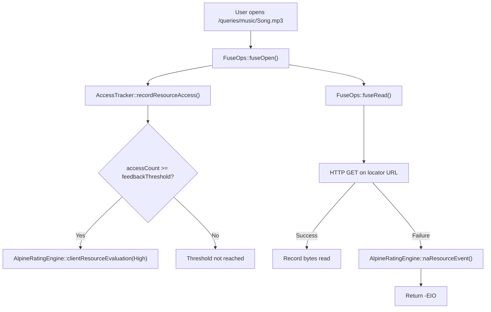

### FUSE Platform Support

| Platform | FUSE Version | Library | Install |
|----------|-------------|---------|---------|
| macOS | FUSE 2 (`FUSE_USE_VERSION=26`) | macFUSE | `brew install macfuse` |
| Linux | FUSE 3 (`FUSE_USE_VERSION=35`) | libfuse3 | `apt install libfuse3-dev` or `dnf install fuse3-devel` |

---

## Module Plugin System

Alpine supports runtime-loadable plugins through `AlpineModuleInterface`:

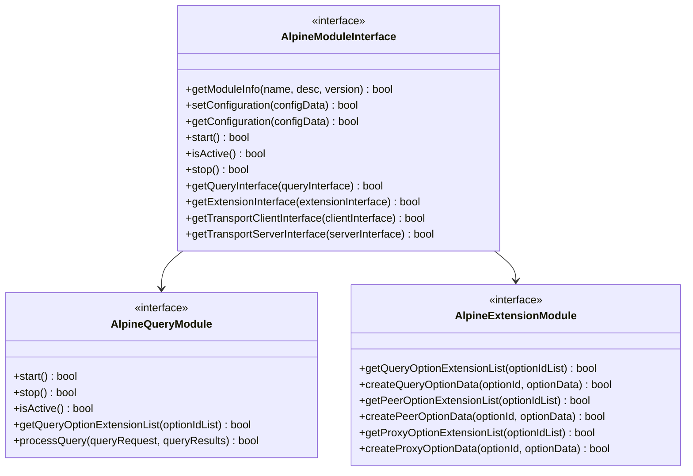

Modules are registered by library path and bootstrap symbol, then loaded dynamically at runtime:

```cpp
auto moduleId = AlpineStackInterface::registerModule2("libMyModule.so", "bootstrap");
AlpineStackInterface::loadModule2(*moduleId);
```

---

## Service Discovery

Beyond its own broadcast protocol, Alpine integrates with standard service discovery mechanisms:

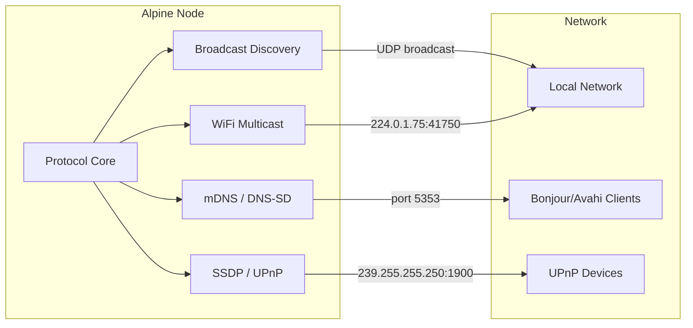

| Protocol | Port | Description |
|----------|------|-------------|
| **mDNS / DNS-SD** | 5353 | Multicast DNS service announcement |
| **SSDP / UPnP** | 1900 | UPnP device discovery (M-SEARCH / NOTIFY) |
| **WiFi Multicast** | 41750 | WiFi-layer peer detection (group 224.0.1.75) |
| **Broadcast** | 8090 | Alpine-native broadcast discovery |
| **Beacon** | 8089 | Periodic beacon announcements |

---

## Configuration

Configuration values are resolved in order of precedence: **config file** > **command-line argument** > **environment variable** > **default**.

### Core Configuration

| Name | CLI Flag | Environment Variable | Default | Description |
|------|----------|---------------------|---------|-------------|
| Port | `port` | `PORT` | 9000 | Main protocol port |
| REST Port | `restPort` | `REST_PORT` | 8080 | HTTP API port |
| REST Bind Address | `restBindAddress` | `REST_BIND_ADDRESS` | 0 | REST bind address |
| Beacon Port | `beaconPort` | `BEACON_PORT` | 8089 | Beacon discovery port |
| Beacon Enabled | `beaconEnabled` | `BEACON_ENABLED` | true | Enable beacon discovery |
| Broadcast Port | `broadcastPort` | `BROADCAST_PORT` | 8090 | Broadcast discovery port |
| Broadcast Enabled | `broadcastEnabled` | `BROADCAST_ENABLED` | true | Enable broadcast discovery |
| WiFi Multicast Group | `wifiMulticastGroup` | `WIFI_MULTICAST_GROUP` | 224.0.1.75 | Multicast group address |
| WiFi Multicast Port | `wifiMulticastPort` | `WIFI_MULTICAST_PORT` | 41750 | Multicast port |
| Log Level | `logLevel` | `LOG_LEVEL` | Info | Logging level (Silent/Error/Info/Debug) |
| Node Name | `nodeName` | `NODE_NAME` | — | Human-readable node identifier |
| Tor Enabled | `torEnabled` | `TOR_ENABLED` | false | Enable Tor integration |
| DLNA Enabled | `dlnaEnabled` | `DLNA_ENABLED` | false | Enable DLNA media server |

### REST Bridge Configuration

| Name | CLI Flag | Environment Variable | Default | Description |
|------|----------|---------------------|---------|-------------|
| API Key | `apiKey` | `ALPINE_API_KEY` | — | API key for REST authentication |
| CORS Origin | `corsOrigin` | `CORS_ORIGIN` | — | Allowed CORS origin |
| HTTP Min Threads | `httpMinThreads` | `HTTP_MIN_THREADS` | 4 | Minimum HTTP worker threads |
| HTTP Max Threads | `httpMaxThreads` | `HTTP_MAX_THREADS` | 32 | Maximum HTTP worker threads |
| HTTP Max Connections | `httpMaxConnections` | `HTTP_MAX_CONNECTIONS` | 512 | Maximum concurrent connections |
| HTTP Max Conn/IP | `httpMaxConnectionsPerIp` | `HTTP_MAX_CONNECTIONS_PER_IP` | 16 | Per-IP connection limit |
| HTTP Idle Timeout | `httpIdleTimeoutSeconds` | `HTTP_IDLE_TIMEOUT_SECONDS` | 60 | Idle connection timeout (seconds) |
| Module Registration | `moduleRegistration` | `MODULE_REGISTRATION` | — | Enable module registration via RPC |
| Module Directory | `moduleDirectory` | `MODULE_DIRECTORY` | — | Allowed directory for module libraries |

### DLNA Configuration

| Name | CLI Flag | Environment Variable | Default | Description |
|------|----------|---------------------|---------|-------------|
| DLNA Port | `dlnaPort` | `DLNA_PORT` | — | DLNA media server port |
| Media Directory | `mediaDirectory` | `MEDIA_DIRECTORY` | — | Path to local media files |
| DLNA Server Name | `dlnaServerName` | `DLNA_SERVER_NAME` | — | UPnP friendly name |
| Transcode Enabled | `transcodeEnabled` | `TRANSCODE_ENABLED` | — | Enable media transcoding |
| DLNA Host Address | `dlnaHostAddress` | `DLNA_HOST_ADDRESS` | — | DLNA bind address |

### Tor Configuration

| Name | CLI Flag | Environment Variable | Default | Description |
|------|----------|---------------------|---------|-------------|
| Tor Control Port | `torControlPort` | `TOR_CONTROL_PORT` | — | Tor control port |
| Tor SOCKS Port | `torSocksPort` | `TOR_SOCKS_PORT` | — | Tor SOCKS proxy port |
| Tor Control Auth | `torControlAuth` | `TOR_CONTROL_AUTH` | — | Tor control auth cookie/password |
| Tor Listen Port | `torListenPort` | `TOR_LISTEN_PORT` | — | Hidden service listen port |
| Tor Peers | `torPeers` | `TOR_PEERS` | — | Comma-separated .onion peer addresses |

### WiFi Discovery Configuration

| Name | CLI Flag | Environment Variable | Default | Description |
|------|----------|---------------------|---------|-------------|
| WiFi Discovery Enabled | `wifiDiscoveryEnabled` | `WIFI_DISCOVERY_ENABLED` | — | Enable WiFi multicast discovery |
| WiFi Announce Interval | `wifiAnnounceInterval` | `WIFI_ANNOUNCE_INTERVAL` | — | Announce interval (seconds) |
| WiFi Peer Timeout | `wifiPeerTimeout` | `WIFI_PEER_TIMEOUT` | — | Peer timeout (seconds) |
| WiFi Interface | `wifiInterface` | `WIFI_INTERFACE` | — | Network interface for multicast |
| WiFi Beacon Interval | `wifiBeaconInterval` | `WIFI_BEACON_INTERVAL` | — | Beacon interval (seconds) |

### Tracing Configuration (requires `ALPINE_ENABLE_TRACING`)

| Name | CLI Flag | Environment Variable | Default | Description |
|------|----------|---------------------|---------|-------------|
| Tracing Enabled | `tracingEnabled` | `TRACING_ENABLED` | — | Enable OpenTelemetry tracing |
| OTLP Endpoint | `otlpEndpoint` | `OTLP_ENDPOINT` | — | OpenTelemetry collector endpoint |

### FUSE Configuration (requires `ALPINE_ENABLE_FUSE`)

| Name | CLI Flag | Environment Variable | Default | Description |
|------|----------|---------------------|---------|-------------|
| FUSE Enabled | `fuseEnabled` | `FUSE_ENABLED` | false | Enable FUSE virtual filesystem |
| FUSE Mount Point | `fuseMountPoint` | `FUSE_MOUNT_POINT` | /tmp/alpine | Filesystem mount path |
| FUSE Cache TTL | `fuseCacheTtl` | `FUSE_CACHE_TTL` | 60 | Query cache TTL (seconds) |
| FUSE Feedback Threshold | `fuseFeedbackThreshold` | `FUSE_FEEDBACK_THRESHOLD` | 5 | Accesses before positive feedback |

---

## Building

Requires CMake 3.28+ and a C++23-capable compiler.

```sh
# Standard release build
cmake -B build -DCMAKE_BUILD_TYPE=Release
cmake --build build

# Debug build
cmake -B build -DCMAKE_BUILD_TYPE=Debug
cmake --build build

# Profile build (with -pg for gprof)
cmake -B build -DCMAKE_BUILD_TYPE=Profile
cmake --build build

# Build with sanitizers
cmake -B build -DALPINE_SANITIZER=address,undefined
cmake --build build
```

### Build Options

| Flag | Default | Description |
|------|---------|-------------|
| `ALPINE_ENABLE_CORBA` | OFF | CORBA remote management (requires ACE/TAO) |
| `ALPINE_ENABLE_TLS` | OFF | TLS/DTLS encryption |
| `ALPINE_ENABLE_FUSE` | OFF | FUSE virtual filesystem (requires libfuse/macFUSE) |
| `ALPINE_ENABLE_UPNP` | OFF | UPnP IGD port mapping |
| `ALPINE_ENABLE_PERSISTENCE` | OFF | SQLite persistence layer |
| `ALPINE_ENABLE_TRACING` | OFF | OpenTelemetry distributed tracing |
| `ALPINE_BUILD_TESTS` | ON | Build test programs |
| `ALPINE_BUILD_BENCHMARKS` | OFF | Build benchmark programs |
| `ALPINE_BUILD_FUZZERS` | OFF | Build libFuzzer targets (requires Clang) |
| `ALPINE_USE_SYSTEM_DEPS` | OFF | Use system packages instead of FetchContent |
| `ALPINE_SANITIZER` | — | Sanitizer mode (address, undefined, thread, memory) |

### Dependencies

Fetched automatically via CMake FetchContent unless `ALPINE_USE_SYSTEM_DEPS=ON`:

| Dependency | Version | Purpose |
|------------|---------|---------|
| [nlohmann/json](https://github.com/nlohmann/json) | 3.11.3 | JSON serialization |
| [ASIO](https://think-async.com/Asio/) | 1.30.2 | Async networking (standalone, no Boost) |
| [spdlog](https://github.com/gabime/spdlog) | 1.14.1 | Logging backend |
| [Catch2](https://github.com/catchorg/Catch2) | 3.5.2 | Testing framework (if tests enabled) |
| [jwt-cpp](https://github.com/Thalhammer/jwt-cpp) | 0.7.0 | JWT authentication (if TLS enabled) |
| [miniupnpc](https://miniupnp.tuxfamily.org/) | 2.2.7 | UPnP port mapping (if UPnP enabled) |
| [SQLite](https://sqlite.org) | 3.45.0 | Persistence (if persistence enabled) |
| [OpenTelemetry](https://opentelemetry.io/) | 1.14.2 | Distributed tracing (if tracing enabled) |
| [Google Benchmark](https://github.com/google/benchmark) | 1.8.3 | Benchmarks (if benchmarks enabled) |

---

## Testing

### Building Tests

Tests are built by default (`ALPINE_BUILD_TESTS=ON`). To skip them:

```sh
cmake -B build -DCMAKE_BUILD_TYPE=Debug -DALPINE_BUILD_TESTS=OFF
cmake --build build
```

### Running Tests

There is no unified test runner. Individual test programs are built into `build/bin/` and run directly:

```sh
# Unit tests (Catch2-based)
./build/bin/test_datablock
./build/bin/test_http_request
./build/bin/test_http_response
./build/bin/test_http_router
./build/bin/test_api_key_auth
./build/bin/test_readwritesem
./build/bin/test_configuration

# Integration tests
./build/bin/test_rest_query_lifecycle
./build/bin/test_rest_peer_endpoints
./build/bin/test_rest_auth_flow
./build/bin/test_rest_rate_limiting

# System tests
./build/bin/auto_thread_test
./build/bin/sys_thread_test
./build/bin/dtcp_stack_test_server    # run in one terminal
./build/bin/dtcp_stack_test_client    # run in another
```

### Sanitizer Builds

```sh
# Address + undefined behavior sanitizer
cmake -B build -DALPINE_SANITIZER=address,undefined
cmake --build build

# Thread sanitizer (detects data races)
cmake -B build -DALPINE_SANITIZER=thread
cmake --build build

# Memory sanitizer (requires Clang, detects uninitialized reads)
cmake -B build -DALPINE_SANITIZER=memory
cmake --build build
```

### Fuzz Testing

Requires Clang with libFuzzer support:

```sh
cmake -B build -DALPINE_BUILD_FUZZERS=ON -DCMAKE_C_COMPILER=clang -DCMAKE_CXX_COMPILER=clang++
cmake --build build

# Run a fuzzer (example)
./build/bin/fuzz_http_request
```

### Benchmarks

```sh
cmake -B build -DCMAKE_BUILD_TYPE=Release -DALPINE_BUILD_BENCHMARKS=ON
cmake --build build
./build/bin/bench_*
```

---

## Platform Support

### Feature Support Matrix

| Feature | Linux | macOS | Windows | FreeBSD |
|---------|-------|-------|---------|---------|
| Core protocol | Yes | Yes | Yes | Yes |
| UDP broadcast discovery | Yes | Yes | Yes | Yes |
| WiFi multicast | Yes | Yes | — | Yes |
| REST API | Yes | Yes | Yes | Yes |
| JSON-RPC | Yes | Yes | Yes | Yes |
| mDNS / DNS-SD | Yes | Yes | — | Yes |
| SSDP / UPnP | Yes | Yes | Yes | Yes |
| DLNA | Yes | Yes | — | Yes |
| Tor integration | Yes | Yes | — | Yes |
| FUSE filesystem | Yes (fuse3) | Yes (macFUSE) | — | Yes (fuse) |
| TLS/DTLS | Yes | Yes | Yes | Yes |
| SQLite persistence | Yes | Yes | Yes | Yes |
| OpenTelemetry tracing | Yes | Yes | Yes | Yes |
| UPnP IGD port mapping | Yes | Yes | Yes | Yes |
| CORBA management | Yes | Yes | — | Yes |

### Compiler Requirements

| Compiler | Minimum Version |
|----------|----------------|
| GCC | 14+ |
| Clang | 17+ |
| MSVC | 2022 (17.x) |

---

## Deployment

### Standalone Server

```sh
./build/bin/AlpineServer
```

The server daemon handles signal-based lifecycle management (graceful shutdown on SIGTERM) and supports configuration hot-reload.

### REST Bridge

```sh
./build/bin/AlpineRestBridge
```

Full-featured HTTP API server with DLNA, mDNS, SSDP, Tor, and FUSE integration.

### Docker

#### Standard Cluster (3 nodes)

```sh
docker-compose -f docker/docker-compose.yml up
```

#### With Benchmark Nodes (5 nodes)

```sh
docker-compose -f docker/docker-compose.yml --profile bench up
```

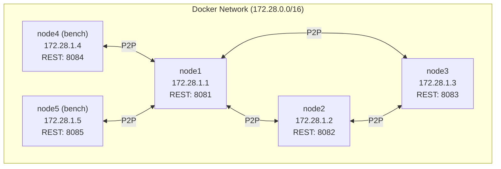

| Node | IP | REST Port | Profile |
|------|----|-----------|---------|
| node1 | 172.28.1.1 | 8081 | default |
| node2 | 172.28.1.2 | 8082 | default |
| node3 | 172.28.1.3 | 8083 | default |
| node4 | 172.28.1.4 | 8084 | bench |
| node5 | 172.28.1.5 | 8085 | bench |

Health checks: `curl -sf http://localhost:{port}/status` every 5 seconds.

#### Multi-Region Cluster

Simulates a WAN-distributed cluster with 3 regions and gateway containers that add ~100ms round-trip inter-region latency via `tc netem`:

```sh
docker compose -f docker/docker-compose.multiregion.yml up
```

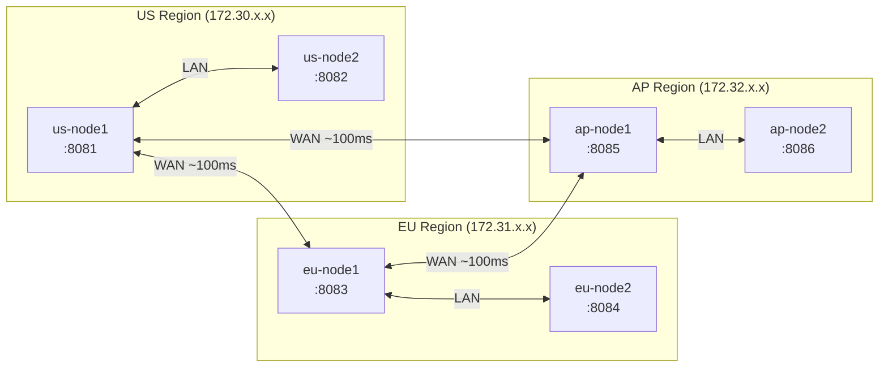

| Node | Region | Subnet | REST Port |
|------|--------|--------|-----------|
| us-node1 | US | 172.30.1.1 | 8081 |
| us-node2 | US | 172.30.1.2 | 8082 |
| eu-node1 | EU | 172.31.1.1 | 8083 |
| eu-node2 | EU | 172.31.1.2 | 8084 |
| ap-node1 | AP | 172.32.1.1 | 8085 |
| ap-node2 | AP | 172.32.1.2 | 8086 |

Set the region via the `ALPINE_REGION` environment variable. The cluster coordinator uses region-aware routing, preferring same-region nodes for query processing.

Verify the cluster formed:

```sh
curl -s http://localhost:8081/cluster/status | jq .
```

### systemd Service

Create `/etc/systemd/system/alpine.service`:

```ini
[Unit]
Description=Alpine P2P Server
After=network.target

[Service]
Type=simple
ExecStart=/usr/local/bin/AlpineRestBridge
Restart=on-failure
RestartSec=5
User=alpine
Group=alpine
LimitNOFILE=65536
Environment=PORT=9000
Environment=REST_PORT=8080
Environment=LOG_LEVEL=Info

[Install]
WantedBy=multi-user.target
```

```sh
sudo systemctl daemon-reload
sudo systemctl enable alpine
sudo systemctl start alpine
```

### Production Hardening

- Set `ALPINE_API_KEY` to require authentication on all REST endpoints
- Configure `CORS_ORIGIN` to restrict cross-origin access
- Use `HTTP_MAX_CONNECTIONS_PER_IP=16` to limit per-client connections
- Set `HTTP_IDLE_TIMEOUT_SECONDS=30` to reclaim idle connections
- Run behind a reverse proxy (nginx, Caddy) for TLS termination
- Set `LOG_LEVEL=Error` in production to reduce I/O
- Use `HTTP_MAX_CONNECTIONS=512` to cap total connections
- Enable `ALPINE_ENABLE_TLS` for encrypted peer-to-peer communication
- Restrict module registration with `MODULE_REGISTRATION=false` or limit to `MODULE_DIRECTORY`

---

## Feature Guides

### DLNA Media Server

Enable DLNA to expose Alpine content to UPnP/DLNA media renderers on the local network:

```sh
./build/bin/AlpineRestBridge --dlnaEnabled true --dlnaPort 8200 \
  --mediaDirectory /path/to/media --dlnaServerName "Alpine Media"
```

Or via environment variables:

```sh
DLNA_ENABLED=true DLNA_PORT=8200 MEDIA_DIRECTORY=/media ./build/bin/AlpineRestBridge
```

The DLNA server advertises itself via SSDP and responds to UPnP ContentDirectory browse requests. Media renderers (TVs, speakers, Sonos, etc.) discover and play content from any Alpine node.

### Tor Integration

Route peer-to-peer traffic through Tor hidden services for anonymized networking:

```sh
./build/bin/AlpineRestBridge --torEnabled true \
  --torControlPort 9051 --torSocksPort 9050 \
  --torListenPort 9001 --torPeers "peer1.onion:9001,peer2.onion:9001"
```

The node creates a Tor hidden service and connects to specified .onion peers via the SOCKS proxy. All P2P protocol traffic is routed through Tor.

### TLS/DTLS Encryption

Build with TLS support for encrypted connections:

```sh
cmake -B build -DALPINE_ENABLE_TLS=ON
cmake --build build
```

Enables DTLS encryption for peer-to-peer transport and ECDSA-based device authentication via the `/auth/*` endpoints.

### FUSE Virtual Filesystem

Build and mount:

```sh
# macOS
brew install macfuse
cmake -B build -DALPINE_ENABLE_FUSE=ON
cmake --build build

# Linux
sudo apt install libfuse3-dev  # Debian/Ubuntu
sudo dnf install fuse3-devel   # Fedora/RHEL
cmake -B build -DALPINE_ENABLE_FUSE=ON
cmake --build build
```

Run with FUSE enabled:

```sh
./build/bin/AlpineRestBridge --fuseEnabled true --fuseMountPoint /tmp/alpine

# Browse queries as files
ls /tmp/alpine/queries/
ls /tmp/alpine/queries/music/
cat /tmp/alpine/queries/music/Song.mp3  # triggers retrieval from peer
```

### OpenTelemetry Tracing

Build with tracing and configure the OTLP exporter:

```sh
cmake -B build -DALPINE_ENABLE_TRACING=ON
cmake --build build

TRACING_ENABLED=true OTLP_ENDPOINT=http://localhost:4317 ./build/bin/AlpineRestBridge
```

Traces are emitted for query, peer, and cluster operations. Use Jaeger, Zipkin, or any OpenTelemetry-compatible collector.

### UPnP Port Mapping

Automatically open ports on the NAT gateway:

```sh
cmake -B build -DALPINE_ENABLE_UPNP=ON
cmake --build build
```

The node uses miniupnpc to request port mappings for the protocol port and REST port through the local router's UPnP IGD.

### SQLite Persistence

Persist peer profiles, group definitions, and query history across restarts:

```sh
cmake -B build -DALPINE_ENABLE_PERSISTENCE=ON
cmake --build build
```

### Clustering

Alpine REST Bridge nodes form clusters via UDP beacon discovery and HTTP heartbeats. The cluster coordinator provides:

- **Query deduplication** — Identical queries across nodes are detected and deduplicated using gossip-based hash sharing
- **Load-aware routing** — Queries are redirected to less-loaded nodes (CPU load + active query count)
- **Federated results** — `/cluster/results/:id` aggregates results from all cluster nodes
- **Region-aware routing** — Same-region nodes are preferred (20% score bonus)
- **Split-brain detection** — Nodes enter isolated mode when >50% of peers are unreachable
- **Distributed reputation** — Peer quality scores are gossiped via heartbeats and merged across nodes
- **Adaptive timeouts** — Node staleness timeouts adjust based on measured RTT

Set `ALPINE_REGION` to enable region-aware routing in multi-region deployments.

---

## Monitoring & Metrics

### Prometheus Metrics

`GET /metrics` returns Prometheus-format metrics:

```sh
curl http://localhost:8080/metrics
```

#### Available Metrics

**Counters** (monotonically increasing):

| Metric | Labels | Description |
|--------|--------|-------------|
| `http_requests_total` | `method={GET,POST,PUT,DELETE,OTHER}` | Total HTTP requests by method |
| `queries_total` | `status={started,completed,failed}` | Total queries by outcome |
| `peers_total` | `event={connected,disconnected}` | Peer connection events |
| `rate_limited_total` | — | Requests rejected by rate limiter |
| `websocket_sessions_total` | `event={opened,closed}` | WebSocket session events |

**Gauges** (current value):

Custom gauges can be registered dynamically by the application.

#### Prometheus Configuration

```yaml
scrape_configs:
  - job_name: 'alpine'
    scrape_interval: 15s
    static_configs:
      - targets: ['localhost:8080']
    metrics_path: '/metrics'
```

### Health Check

```sh
curl http://localhost:8080/status
```

Returns server status and version. Used by Docker health checks and load balancers.

---

## Security

- **Duplicate packet detection** with configurable thresholds
- **Packet size limits** for queries, resource descriptions, and peer lists
- **Peer banning** for misbehaving nodes (`POST /admin/peers/:id/ban`)
- **Bad packet tracking** with per-peer counters and quality impact
- **Reliable transfer failure monitoring** with automatic quality adjustment
- **Host/subnet exclusion** lists for network-level blocking
- **API key authentication** middleware for REST endpoints (`ALPINE_API_KEY`)
- **CORS configuration** for browser-based clients (`CORS_ORIGIN`)
- **Per-IP connection limits** to prevent resource exhaustion (`HTTP_MAX_CONNECTIONS_PER_IP`)
- **Rate limiting** with 429 responses and metrics tracking
- **Challenge-response device authentication** via `/auth/*` endpoints (ECDSA with TLS)
- **Module path restriction** — module registration can be restricted to a specific directory
- **NAT traversal** discovery for secure peer-to-peer connections
- **TLS/DTLS encryption** for peer-to-peer transport (optional)
- **Tor hidden services** for anonymized networking (optional)

---

## License

MIT

## Copyright

Copyright (c) 2026 sonoransun
