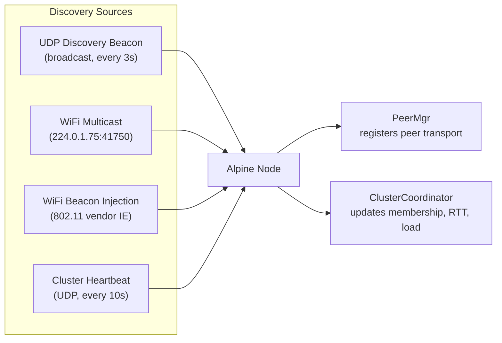
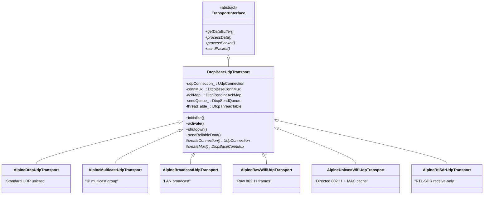
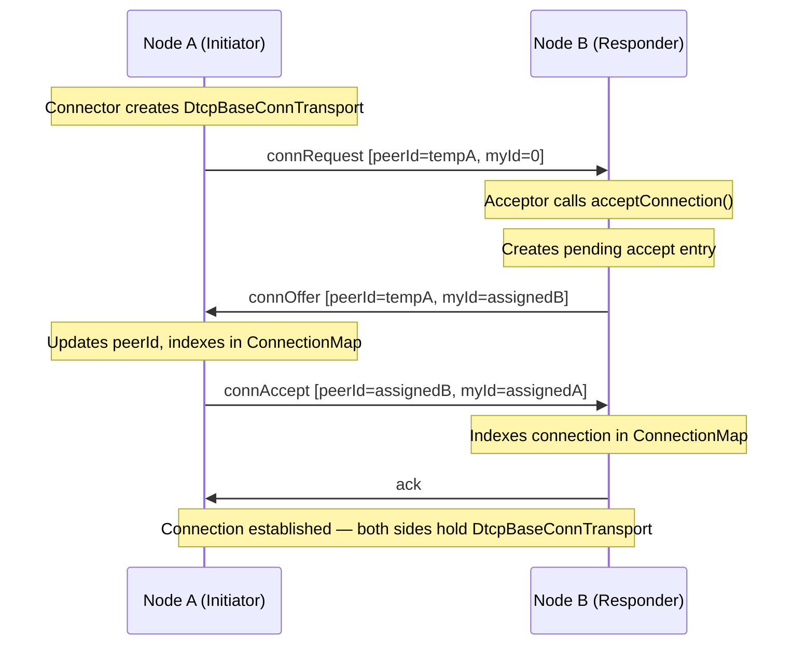
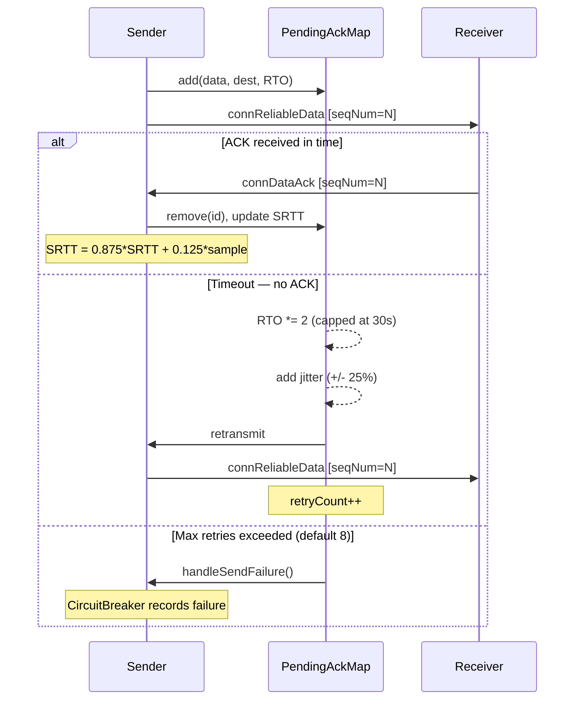
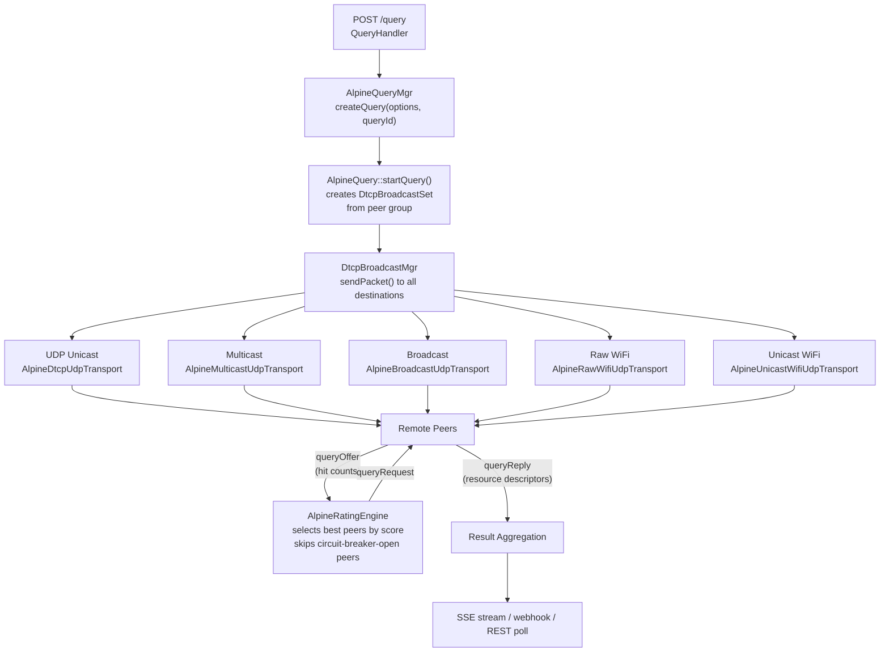
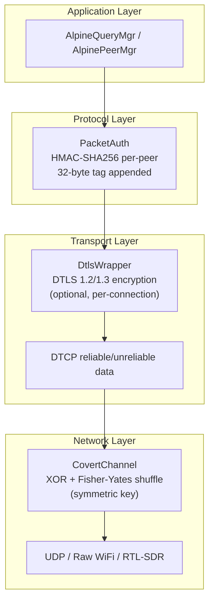

# Discovery & Communication Deep Dive

This document explains how Alpine nodes discover each other, establish connections, transfer data reliably, and propagate queries across multiple transport types. It is the companion reference to the architecture overview in [README.md](../README.md).

---

## Table of Contents

- [Discovery Mechanisms](#discovery-mechanisms)
- [Transport Stack Architecture](#transport-stack-architecture)
- [DTCP Connection Protocol](#dtcp-connection-protocol)
- [Query Propagation](#query-propagation)
- [802.11 Frame Format](#80211-frame-format)
- [RTL-SDR Radio Reception](#rtl-sdr-radio-reception)
- [Security Layers](#security-layers)
- [Protocol Constants Reference](#protocol-constants-reference)

---

## Discovery Mechanisms

Alpine nodes find each other through four independent discovery paths that can operate simultaneously. Each feeds into the `PeerMgr` (for protocol-level peer tracking) or `ClusterCoordinator` (for cluster membership).



### UDP Discovery Beacon

The `DiscoveryBeacon` class (`AlpineRestBridge/DiscoveryBeacon.h`) broadcasts a JSON advertisement to `INADDR_BROADCAST` on a configurable port every 3 seconds:

```json
{
  "service": "alpine-bridge",
  "version": "1",
  "restPort": 8081,
  "bridgeVersion": "devel-00019"
}
```

Optionally joins an IPv6 multicast group for dual-stack environments. Uses `SO_BROADCAST` and `IP_FREEBIND` (Linux) for early startup before interface assignment.

### WiFi Multicast Discovery

The `MulticastDiscovery` thread (`base/NetUtils/MulticastDiscovery.h`) joins a configurable multicast group (default `224.0.1.75:41750`) and exchanges richer JSON announcements:

```json
{
  "type": "alpine_discover",
  "version": "1",
  "peerId": "bridge-a1b2c3",
  "ipAddress": "192.168.1.10",
  "port": 12345,
  "restPort": 8081,
  "capabilities": ["query", "transfer"],
  "timestamp": 1712956800
}
```

TTL is set to 1 (link-local only) and loopback is disabled. Peers are expired after the configurable timeout (default 30 seconds).

### WiFi Beacon Injection

The `WifiBeaconInjector` (`base/NetUtils/WifiBeaconInjector.h`) injects 802.11 beacon frames containing Alpine discovery data as a vendor-specific Information Element. This works even without associated WiFi infrastructure, enabling discovery in monitor mode. Requires Linux with `CAP_NET_RAW`. Uses Alpine OUI `02:A1:E1` with OUI Type `0x01`. Default injection interval: 3000 ms.

### Cluster Heartbeats

The `ClusterCoordinator` (`AlpineRestBridge/ClusterCoordinator.h`) provides distributed cluster membership. Every 10 seconds, nodes exchange heartbeats containing:

- `nodeId`, `host`, `restPort`
- `activeQueries`, `connectionCount`, `cpuLoadEstimate`
- `region`, `capabilities`
- Measured RTT between nodes

Stale nodes are evicted after an adaptive timeout (35-120 seconds). **Split-brain detection** triggers when >50% of known nodes become unreachable, causing health probes to return 503. **Query deduplication** across the cluster uses an 8-shard hash map with a 30-second window. **Load-aware routing** redirects queries to less-loaded nodes when the local node is overloaded.

---

## Transport Stack Architecture

All transports share the DTCP reliable layer. Each transport overrides `createConnection()` to supply the appropriate socket type, and `createMux()` to instantiate the connection multiplexer.

### Class Hierarchy



### Transport Comparison

| Transport | Socket Type | Direction | Medium | Platform | Privileges | Use Case |
|-----------|-------------|-----------|--------|----------|-----------|----------|
| UDP Unicast | `UdpConnection` | Bidirectional | Standard UDP | All | None | Primary peer-to-peer |
| Multicast | `MulticastUdpConnection` | Bidirectional | IP multicast group | All | None | LAN discovery, query fan-out |
| Broadcast | `BroadcastUdpConnection` | Bidirectional | LAN broadcast | All | None | Fallback when multicast unavailable |
| Raw WiFi | `RawWifiConnection` | Bidirectional | Raw 802.11 frames | Linux | `CAP_NET_RAW` | Infrastructure-less wireless |
| Unicast WiFi | `UnicastWifiConnection` | Bidirectional | Directed 802.11 | Linux | `CAP_NET_RAW` | Point-to-point WiFi with MAC resolution |
| RTL-SDR | `RtlSdrConnection` | Receive-only | GFSK radio | Linux | USB device | Passive radio monitoring |

> RTL-SDR is gated behind the `ALPINE_ENABLE_RTLSDR` CMake option and requires `librtlsdr`.

### Threading Model

Each `DtcpBaseUdpTransport` instance spawns three thread types:

- **`DtcpSocketThread`** -- Polls the transport's file descriptor (via `PollSet`) and reads incoming datagrams. For RTL-SDR, this polls the self-pipe that the demodulator thread writes to.
- **`DtcpMonitorThread`** -- Processes timed events: retransmission timeouts, connection keepalives, and broadcast progress tracking.
- **`DtcpStackThread`** (pool of up to 25) -- Worker threads that process received `DtcpIORecord` items from the `DtcpThreadTable`. Each record contains the raw datagram and sender address. Workers parse the DTCP packet and dispatch to the appropriate connection handler.

---

## DTCP Connection Protocol

DTCP (Distributed Transport Connection Protocol) provides connection-oriented reliable delivery over UDP. Every transport type uses the same DTCP protocol, regardless of the underlying medium.

### Packet Types

| Type | Value | Direction | Purpose |
|------|-------|-----------|---------|
| `connRequest` | 1 | Initiator -> Responder | Open connection |
| `connOffer` | 2 | Responder -> Initiator | Accept connection |
| `connAccept` | 3 | Initiator -> Responder | Confirm connection |
| `connSuspend` | 4 | Either | Pause data flow |
| `connResume` | 5 | Either | Resume data flow |
| `connData` | 6 | Either | Unreliable data |
| `connReliableData` | 7 | Either | Reliable data (ACK required) |
| `connDataAck` | 8 | Either | Acknowledge reliable data |
| `connClose` | 9 | Either | Close connection |
| `poll` | 10 | Either | Keepalive probe |
| `ack` | 11 | Either | Generic acknowledgment |
| `error` | 12 | Either | Error indication |
| `natDiscover` | 13 | Either | NAT traversal request |
| `natSource` | 14 | Either | NAT source address report |
| `txnData` | 15 | Either | Transaction layer data |

### Connection Establishment (3-Way Handshake)



Each connection packet (`DtcpConnPacket`) carries: `peerId`, `myId`, `peerIpAddress`, `peerPort`, `prevIpAddress`, `prevPort` (for mobility/NAT), and `sequenceNum`.

The `AlpineDtcpConnConnector` implements exponential backoff on connection failure: initial delay 1s, multiplier 2x, max 60s, with 25% jitter.

### Reliable Data Transfer

The `DtcpPendingAckMap` manages retransmission for `connReliableData` packets. RTT is estimated per-peer using TCP-style EWMA (RFC 6298).



The `DtcpSendQueue` shapes outgoing bandwidth with a two-tier priority queue: reliable transfers are sent before normal data. A configurable `transferRate` (bytes/sec, 0 = unlimited) controls the send pace.

### RTT Estimation Constants

| Constant | Value | Description |
|----------|-------|-------------|
| `kSrttAlpha` | 0.125 | EWMA weight for RTT samples |
| `kSrttBeta` | 0.25 | EWMA weight for RTT variance |
| `kDefaultRtoMs` | 200 ms | Initial RTO for unknown peers |
| `kMaxRtoMs` | 30,000 ms | Maximum RTO cap |
| `kJitterFraction` | 0.25 | Random jitter range on RTO |
| `kDefaultMaxRetries` | 8 | Max retransmission attempts |

---

## Query Propagation

When a query is submitted, it fans out across all active transport types simultaneously. The query manager processes higher-priority queries first (0-255, default 128).



Key behaviors:

- **Multi-transport fan-out** -- A single `DtcpBroadcastSet` contains peer connections across all transport types. The broadcast sends the query packet to every destination regardless of which transport carries it.
- **Rating-based selection** -- After receiving `queryOffer` responses, the `AlpineRatingEngine` ranks peers by their quality score (exponential moving average of success/failure). Only the top-ranked peers receive `queryRequest`.
- **Circuit breaker skipping** -- Peers with open circuit breakers (after N consecutive failures, default 5) are excluded entirely from the broadcast set. HalfOpen peers receive a single probe; success closes the breaker, failure reopens it.
- **RTL-SDR is receive-only** -- Queries cannot be sent via RTL-SDR, but query responses received via radio are processed normally and fed into the aggregation pipeline.
- **Cluster deduplication** -- Before starting, the `ClusterCoordinator` checks whether any cluster peer is already running the same query (hash-based, 30-second window). Duplicates are redirected.

---

## 802.11 Frame Format

The raw WiFi transports (`AlpineRawWifiUdpTransport` and `AlpineUnicastWifiUdpTransport`) encapsulate DTCP packets in 802.11 data frames using `AF_PACKET` raw sockets on Linux.

### Wire Format

```
 0                   8                  32                 56       56+N
 ├───────────────────┼──────────────────┼──────────────────┼─────────────┤
 │   Radiotap Hdr    │  802.11 MAC Hdr  │   LLC/SNAP Hdr   │   Payload   │
 │     8 bytes       │    24 bytes      │     8 bytes      │   N bytes   │
 └───────────────────┴──────────────────┴──────────────────┴─────────────┘

 Radiotap (8 bytes):
   [version:1] [pad:1] [length:2 LE] [present_flags:4]

 802.11 MAC Header (24 bytes, 3-address format):
   [Frame Control:2]  0x0008 = data frame
   [Duration/ID:2]
   [Address 1:6]       Destination MAC (broadcast FF:FF:FF:FF:FF:FF or unicast)
   [Address 2:6]       Source MAC (local interface)
   [Address 3:6]       BSSID (broadcast for ad-hoc)
   [Sequence Ctrl:2]

 LLC/SNAP Header (8 bytes):
   [DSAP:1] 0xAA
   [SSAP:1] 0xAA
   [Control:1] 0x03
   [OUI:3]  02:A1:E1  (Alpine vendor OUI)
   [EtherType:2] 0xA1E1  (Alpine DTCP)

 Payload:
   [destIp:4] [destPort:2] [srcIp:4] [srcPort:2] [DTCP data:N]
```

Total frame overhead: **40 bytes** per frame.

The payload carries an addressing prefix (`destIp`, `destPort`, `srcIp`, `srcPort`) so that DTCP's IP/port-based connection multiplexing works over the MAC-addressed 802.11 medium.

### Unicast WiFi MAC Resolution

`UnicastWifiConnection` extends `RawWifiConnection` to send directed frames to a specific peer's MAC address instead of the broadcast address. MAC addresses are resolved through three mechanisms:

1. **Frame inspection** (primary) -- When receiving a frame, the source MAC is extracted from 802.11 Address 2 (offset `radiotapLen + 10`) and cached against the source IP.
2. **ARP table lookup** (fallback) -- Parses `/proc/net/arp` to find the MAC for a given IP address.
3. **External injection** -- The discovery system or manual configuration can call `setDestinationMac(ip, mac)` to pre-populate the cache.

The MAC cache uses a 300-second TTL. If no MAC can be resolved, the frame falls back to broadcast delivery (graceful degradation).

### CovertChannel Integration

When enabled, `CovertChannel` applies two-stage obfuscation to the payload before transmission and reverses it on reception:

1. **XOR cipher** -- Each payload byte is XORed with a rotating key byte
2. **Fisher-Yates shuffle** -- Byte positions are permuted using an FNV-1a seeded PRNG (`xorshift32`)

This provides traffic camouflage on the wire but is not cryptographic security. Use DTLS for encryption.

---

## RTL-SDR Radio Reception

The RTL-SDR transport enables passive reception of digital radio payloads using cheap RTL2832U USB dongles. This is a **receive-only** transport: `sendData()` always returns false. Transmission must use another transport (UDP, WiFi, etc.).

> Requires `ALPINE_ENABLE_RTLSDR=ON` at build time and the `librtlsdr` library.

### Radio Frame Format

Over-the-air packets use a simple framing protocol compatible with the `SdrDemodulator` interface:

```
 ┌──────────────┬──────────────┬──────────────┬──────────────┬─────────┐
 │   Preamble   │  Sync Word   │    Length     │   Payload    │  CRC-16 │
 │  4x 0xAA     │  0xA1 0xE1   │  2 bytes BE  │   N bytes    │ 2 bytes │
 └──────────────┴──────────────┴──────────────┴──────────────┴─────────┘
```

- **Preamble** (4 bytes) -- Alternating `10101010` pattern for clock recovery
- **Sync word** (2 bytes) -- `0xA1 0xE1` (matches Alpine's EtherType for consistency)
- **Length** (2 bytes, big-endian) -- Payload length in bytes (max 4096)
- **Payload** (N bytes) -- Addressed DTCP data: `[destIp:4][destPort:2][srcIp:4][srcPort:2][data:N]`
- **CRC-16/CCITT** (2 bytes) -- Computed over the length + payload fields

### Demodulator Pipeline

```mermaid
flowchart LR
    DEV["RTL-SDR USB\nDevice"] -->|"rtlsdr_read_async\n8 x 32KB buffers"| IQ["IQ Samples\n(int8 pairs)"]
    IQ --> FM["FM Discriminator\nconjugate multiply"]
    FM --> CLK["Mueller-Muller\nClock Recovery"]
    CLK --> SYM["Symbol Slicer\nthreshold = 0"]
    SYM --> FSM["Packet State Machine\nPREAMBLE -> SYNC ->\nLENGTH -> PAYLOAD -> CRC"]
    FSM -->|"CRC valid"| Q["Packet Queue\n(max 1024)"]
    Q -->|"write 1 byte"| PIPE["Self-Pipe\npipeFds[1]"]
    PIPE -->|"PollSet wakes"| SOCK["DtcpSocketThread"]
    SOCK -->|"receiveData()"| DTCP["DTCP Stack\nprocessData()"]
```



The **self-pipe trick** is the key integration mechanism: `RtlSdrConnection::getFd()` returns the read end of a `pipe2()` pair. When the demodulator thread extracts a complete packet, it pushes it to a thread-safe deque and writes one byte to the pipe. This wakes the `DtcpSocketThread`'s `PollSet::poll()`, which then calls `receiveData()` to dequeue the packet.

### GFSK Demodulator

The default `GfskDemodulator` targets 9600 baud GFSK with +/-4800 Hz deviation. The demodulation stages are:

1. **FM discrimination** -- Conjugate multiply of consecutive IQ samples gives instantaneous frequency
2. **Mueller-Muller clock recovery** -- Adjusts sampling phase to align with symbol transitions (gain = 0.01, max correction = 0.1)
3. **Symbol slicing** -- Positive frequency = bit 1, negative = bit 0
4. **Packet state machine** -- Hunts for preamble (4x `0xAA` bytes), then sync word (`0xA1E1`), reads length and payload, validates CRC-16

The demodulator interface (`SdrDemodulator`) is pluggable -- additional modulation schemes can be added by implementing `initialize()`, `demodulate()`, and `modulationName()`.

---

## Security Layers

Three security mechanisms operate at different levels of the stack:



### PacketAuth (Protocol Layer)

Per-peer HMAC-SHA256 authentication. Each peer relationship has a shared secret stored in `SecureString` (zero-on-destroy). A 32-byte HMAC tag is computed over the packet payload and appended on send / verified on receive. Enabled via the `Packet Auth Enabled` configuration option.

### DTLS Encryption (Transport Layer)

Optional DTLS wrapping of DTCP connections via OpenSSL. Compiled in only with `ALPINE_ENABLE_TLS=ON`. Supports both DTLS (for UDP transports) and TLS (for TCP). Peer certificate verification is available through `PeerTlsVerifier` with CN/SAN matching. Mutual TLS can be enforced cluster-wide: connections without TLS are rejected when `PeerTlsVerifier::isMutualTlsEnabled()` returns true.

### CovertChannel (Network Layer)

Lightweight payload obfuscation applied at the socket level (inside `RawWifiConnection::sendData()` / `receiveData()`). Two stages: XOR cipher with a rotating key, then Fisher-Yates byte shuffle seeded by FNV-1a hash of the key. The same key deobfuscates (shuffle is recorded and reversed, XOR is self-inverse). This is traffic camouflage, not encryption.

---

## Protocol Constants Reference

| Constant | Value | Source | Description |
|----------|-------|--------|-------------|
| Alpine EtherType | `0xA1E1` | `RawWifiConnection.h` | 802.11 LLC/SNAP EtherType |
| Alpine OUI | `02:A1:E1` | `RawWifiConnection.h` | 802.11 vendor OUI |
| 802.11 frame overhead | 40 bytes | `RawWifiConnection.h` | Radiotap + MAC + LLC/SNAP |
| MAC cache TTL | 300 s | `UnicastWifiConnection.h` | Unicast WiFi MAC expiry |
| Default RTO | 200 ms | `DtcpPendingAckMap.h` | Initial retransmission timeout |
| Max RTO | 30,000 ms | `DtcpPendingAckMap.h` | Maximum backoff ceiling |
| Max retries | 8 | `DtcpPendingAckMap.h` | Reliable send max attempts |
| SRTT alpha | 0.125 | `DtcpPendingAckMap.h` | RTT EWMA weight |
| SRTT beta | 0.25 | `DtcpPendingAckMap.h` | RTT variance EWMA weight |
| RTO jitter | +/-25% | `DtcpPendingAckMap.h` | Randomized jitter range |
| Beacon interval | 3 s | `DiscoveryBeacon.h` | UDP discovery beacon period |
| Heartbeat interval | 10 s | `ClusterCoordinator.h` | Cluster heartbeat period |
| Node timeout (min) | 35 s | `ClusterCoordinator.h` | Minimum stale node timeout |
| Node timeout (max) | 120 s | `ClusterCoordinator.h` | Maximum adaptive timeout |
| Split-brain threshold | 50% | `ClusterCoordinator.h` | Unreachable fraction for isolation |
| Dedup window | 30 s | `ClusterCoordinator.h` | Query deduplication TTL |
| Dedup shards | 8 | `ClusterCoordinator.h` | Sharded dedup map count |
| Multicast group | `224.0.1.75` | `WifiDiscovery.h` | Default discovery multicast |
| Multicast port | 41750 | `WifiDiscovery.h` | Default discovery port |
| Announce interval | 5 s | `WifiDiscovery.h` | Multicast announce period |
| Peer timeout | 30 s | `WifiDiscovery.h` | Discovered peer expiry |
| WiFi beacon interval | 3000 ms | `WifiDiscovery.h` | 802.11 beacon injection period |
| Connection backoff (initial) | 1.0 s | `AlpineDtcpConnConnector.h` | First retry delay |
| Connection backoff (max) | 60.0 s | `AlpineDtcpConnConnector.h` | Maximum retry delay |
| Connection backoff multiplier | 2.0x | `AlpineDtcpConnConnector.h` | Exponential factor |
| Connection backoff jitter | 25% | `AlpineDtcpConnConnector.h` | Randomized jitter |
| Radio preamble | `4x 0xAA` | `SdrDemodulator.h` | Radio frame preamble |
| Radio sync word | `0xA1 0xE1` | `SdrDemodulator.h` | Radio frame sync marker |
| Max radio payload | 4096 bytes | `SdrDemodulator.h` | SDR frame payload cap |
| GFSK baud rate | 9600 | `GfskDemodulator.h` | Default radio baud rate |
| RTL-SDR queue depth | 1024 packets | `RtlSdrConnection.h` | Receive queue cap |
| RTL-SDR block size | 32 KB | `RtlSdrConnection.cpp` | Async read buffer size |
| RTL-SDR buffer count | 8 | `RtlSdrConnection.cpp` | Async reader buffers |
| Send queue workers | 25 | `DtcpThreadTable.h` | Max DTCP processing threads |
| Circuit breaker threshold | 5 failures | `CircuitBreaker.h` | Consecutive failures to open |
| Circuit breaker timeout | 30 s | `CircuitBreaker.h` | Open-to-HalfOpen delay |
